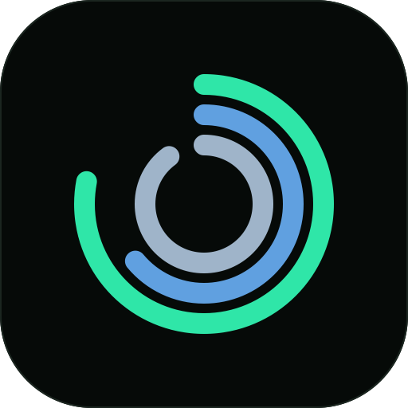

<p align="center">
  
</p>

<h1 align="center">NOOP AI</h1>

<p align="center"><b>An iPhone health coach for your WHOOP strap. Your data, on your device, no cloud.</b></p>

<p align="center"><sub>A fork of <a href="https://github.com/ryanbr/noop">NOOP</a>, focused on iOS and a smarter AI coach.</sub></p>

<p align="center">
  
  
  
  
  
  <a href="LICENSE"></a>
</p>

---

## What NOOP AI is

NOOP AI is a personal fork of [**NOOP**](https://github.com/ryanbr/noop) — the independent,
offline companion app for WHOOP 4.0 / 5.0 straps. It keeps everything that makes NOOP good
(on-device biometrics, recovery/strain/HRV/sleep math, no account, no cloud) and concentrates
on two things:

1. **iOS only.** This fork ships and is tuned for iPhone. The macOS and Android targets from
   upstream are kept in the tree so updates keep merging cleanly, but are not the focus here.
2. **A coach that reaches the level of a real AI health assistant** — conversational, grounded
   in *your* numbers, with a personality and proactive check-ins.

Everything still runs on your device with your own AI provider key; no health data leaves the
phone except the request you deliberately make to your chosen model.

## What this fork adds to the coach

| Feature | What it does |
|---|---|
| **Coaching personas** | Pick a voice — **Guardian** (calm, protective), **Friend** (warm, encouraging) or **Commander** (direct, action-oriented). Tone only; the methodology and safety guardrails are unchanged. |
| **Tool-calling** | Instead of one pre-baked text block, the coach is given *tools* and fetches your real data on demand — biometric summary, recent workouts, today's stress index, your personal patterns — so it cites actual numbers instead of guessing. (Anthropic today.) |
| **Daily check-in** | An opt-in daily reminder so the coach reaches out first. Tapping it opens NOOP and auto-generates *Today's brief* — readiness, what to train, one thing to improve. |
| **Editable instructions** | The existing free-text system-prompt editor still applies underneath any persona. |

These build on NOOP's existing **automatic Apple Health sync** (HealthKit background delivery via
observer + anchored queries, plus write-back of NOOP-computed vitals, sleep and workouts) — so the
coach is always reasoning over fresh data.

> Design note: every addition lives in its own file (`CoachPersona.swift`, `CoachTools.swift`,
> `Providers/AnthropicTools.swift`, `CoachCheckIn.swift`) and never rewrites upstream files, so
> `git merge upstream` stays low-conflict.

## Quickstart (iOS)

Requires a Mac with **Xcode 26+**, [`xcodegen`](https://github.com/yonaskolb/XcodeGen)
(`brew install xcodegen`), and a **physical iPhone** (BLE and HealthKit don't work in the Simulator).
A free Apple ID is enough to sign an on-device build.

```bash
# 1. Clone your fork
git clone https://github.com/DX23876/noop.git NOOP-AI
cd NOOP-AI

# 2. Generate the Xcode project from project.yml
xcodegen generate

# 3. Open, then run the NOOPiOS scheme on your iPhone
open Strand.xcodeproj
#    Select the "NOOPiOS" scheme → pick your device → set your signing team → Run (⌘R)
```

In the app: pair your strap, grant Apple Health access, then open **Coach**, connect a provider
(paste your own API key), choose a coaching style, and turn on the daily check-in.

## Staying in sync with upstream NOOP

This fork tracks [ryanbr/noop](https://github.com/ryanbr/noop) so new upstream features flow in:

```bash
git remote add upstream https://github.com/ryanbr/noop.git   # one time
git fetch upstream
git merge upstream/main        # resolve README/branding conflicts in favour of this fork
```

---

## Attribution

NOOP AI is a fork of **[NOOP](https://github.com/ryanbr/noop)** by ryanbr — please treat that
repository as the canonical upstream. NOOP itself stands on community protocol-documentation work:

- **`johnmiddleton12/my-whoop`** — the WHOOP 4.0 BLE protocol behind the `WhoopProtocol` / `WhoopStore` packages.
- **`b-nnett/goose`** — the WHOOP 5.0 / MG BLE protocol documentation.
- **`groue/GRDB.swift`** — SQLite persistence. · **`weichsel/ZIPFoundation`** — export unzipping.

NOOP contains no WHOOP proprietary code, firmware, logos, or assets. Full detail in
[`ATTRIBUTION.md`](ATTRIBUTION.md).

## Disclaimer

NOOP AI is an independent, unofficial, non-commercial interoperability project. It is **not
affiliated with, endorsed by, or connected to WHOOP, Inc.** All references to "WHOOP" are nominative.

**NOOP is not a medical device.** Heart rate, HRV, recovery, strain, sleep stages, SpO₂, respiratory
rate and skin temperature are **approximations** from published methods — not clinically validated,
not medical advice. The AI coach is not a doctor and must not be used to diagnose or treat. Consult a
qualified professional. Provided **as-is, with no warranty**, for **personal and educational use**.
See [`DISCLAIMER.md`](DISCLAIMER.md).

## License

Source-available under the [PolyForm Noncommercial License 1.0.0](LICENSE): **free for personal and
other non-commercial use** — read it, run it, fork it. Commercial use is not granted. This fork keeps
the upstream `LICENSE` and `Copyright 2026 NoopApp` notice intact, per NOOP's mirroring terms; bundled
dependencies keep their own licenses (see [`NOTICE`](NOTICE)).

## Docs

- [`docs/IOS.md`](docs/IOS.md) — iOS build and HealthKit details.
- [`docs/BUILD.md`](docs/BUILD.md) — full build instructions.
- [`CHANGELOG.md`](CHANGELOG.md) — upstream release history.
- [`project.yml`](project.yml) — XcodeGen project definition (source of `Strand.xcodeproj`).
