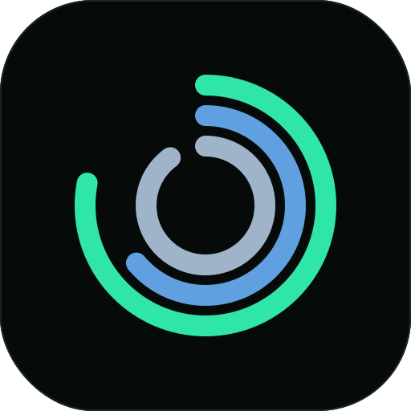

<p align="center">
  
</p>

<h1 align="center">NOOP AI</h1>

<p align="center"><b>Your WHOOP data, on your iPhone, with a coach that actually remembers you.</b></p>

<p align="center">
  
  
  
  
  
  
  <a href="LICENSE"></a>
</p>

---

## What is this?

You own a WHOOP strap. It measures you all day. But the numbers live behind someone else's app and
someone else's subscription.

**NOOP** solves the first half of that: it talks to your strap over Bluetooth, stores everything in
a database on your phone, and computes recovery, strain, sleep and HRV **entirely on-device** — no
server, no account, no telemetry. It's a genuinely lovely piece of clean-room engineering, and it's
somebody else's project: **[ryanbr/noop](https://github.com/ryanbr/noop)**.

**NOOP AI** — this fork — solves a second half that only matters to one person: *the numbers still
don't talk back.* So it grows an AI coach into a thing you'd actually open every morning. One that
knows your training goal, remembers the knee you tweaked in March, can pull your real numbers when
it needs them, and can say "your HRV is 12 % under baseline, take today easy" — because it went and
looked.

> **Just want a great WHOOP app?** Use **[ryanbr/noop](https://github.com/ryanbr/noop)**. It's the
> real project — macOS, Android, iOS, actively maintained, and the right answer for almost everyone.
> This fork is for the narrow case: you only carry an iPhone, and you want the coach pushed further
> than a cross-platform project could reasonably justify.

## This is a fork, not a rename

NOOP AI is a **personal fork** of [ryanbr/noop](https://github.com/ryanbr/noop). Not a competitor,
not a rebrand that hides where it came from. Every protocol decoder, every analytics formula, every
pixel of the design system comes from upstream NOOP and its own credited sources
(see [Attribution](#attribution)). This fork carries exactly two deliberate changes on top:
**iOS only**, and **a much bigger coach**.

### Why fork instead of contributing upstream?

Upstream NOOP runs on a hard rule: **analytics and stored data must be byte-identical between the
Swift and Kotlin implementations.** That's exactly the right rule for a dependable cross-platform
WHOOP client — but it means every feature has to earn its place on macOS, iOS *and* Android at
once, kept in lockstep, forever.

A fast-moving, opinionated, iPhone-only AI coach is precisely the kind of thing that rule *should*
keep out of the core project. It doesn't need an Android twin. It doesn't need macOS to make sense.
It needs to iterate quickly, on one platform, for one person. So rather than push upstream toward a
"no" it would be right to give, it lives here.

**What that means in practice:**

- **iOS only.** This fork builds the `NOOPiOS` target. The macOS (`Strand`) and Android trees are
  **kept but untouched** — purely so `git merge upstream` keeps working. They're not built, not
  tested, not supported here.
- **Additive only.** Everything this fork adds lives in its own new files under `Strand/AI/`. No
  upstream logic is rewritten in place. Nothing touches BLE, protocol decoding, or the analytics
  math — the parts that genuinely benefit from cross-platform parity are left completely alone.
- **It works.** Upstream `v9.0.0` merged into this fork with **zero conflicts**. That's the whole
  design paying off.

## The coach

The base app already had a chat-with-your-own-API-key coach that got one pre-baked block of text
per message. This fork turns that into something closer to an agent with hands and a memory.

### It fetches its own data (14 tools)

Instead of being handed a fixed summary, the coach decides what it needs and goes and gets it —
mid-sentence, while it's answering you.

| | Tool | What it pulls |
|---|---|---|
| 📊 | `get_biometric_summary` | 14 days of charge/effort/rest/HRV/RHR + 30-day averages |
| 🏃 | `get_recent_workouts` | Your recent sessions, with effort and heart rate |
| 😰 | `get_stress_index` | Today's autonomic load (Baevsky index over your R-R intervals) |
| 😴 | `get_sleep_detail` | Per-night stages, efficiency, and your rolling sleep-debt ledger |
| 📅 | `get_range_report` | Any 7–365 day window: averages, trends, headline changes |
| 🔍 | `get_personal_patterns` | Your own n-of-1 correlations ("late meals cost you 8 % recovery") |
| 📈 | `plot_metric` | Draws a real chart, inline in the chat |
| 🧠 | `remember_fact` · `update_fact` · `forget_fact` | Its own long-term memory (below) |
| 🕰️ | `search_past_conversations` | Finds what you discussed weeks ago |
| ☕ | `log_caffeine` · `log_journal` · `log_lab_marker` | **Writes** to your real app data |

That last row is the fun one: **"just had a double espresso"** becomes a genuine entry in the
Caffeine card. **"drank last night"** becomes a journal entry. **"my Vitamin D came back at 38"**
becomes a Lab Book marker. Same data the app always had — just logged by talking instead of tapping
through a form.

### It has a real memory

This is the part most AI chat features get wrong: they either forget everything, or they dump
everything into every prompt until it's expensive and unfocused. NOOP AI's memory works more like a
person's.

- **Facts have shape.** Each remembered fact carries a *category* (goal, injury, preference,
  physiology, schedule) and an *importance*. **Pinned** facts — a serious injury, a hard constraint
  — ride along on every single reply. Everything else is only pulled in when it's actually relevant
  to what you just asked.
- **It corrects itself.** The coach can `update_fact` and `forget_fact`, not just append. Tell it
  your knee is fine now and the stale fact gets rewritten, not stacked next to a contradiction.
  Near-duplicates are detected and merged, so rephrasings don't eat the memory budget.
- **It remembers past conversations.** Old chats aren't dead scrollback — the coach can search them,
  and a short digest of recent conversations rides along for continuity.
- **It tidies up cheaply.** When you move on from a chat, a **small, cheap model** (Haiku /
  gpt-4o-mini / Flash-Lite — you pick) quietly distils it into a one-line summary plus any durable
  facts. Your expensive coaching model never pays for housekeeping.

Every fact is visible and editable in Settings. Nothing is remembered that you can't see, correct,
or delete.

### The rest of it

| Feature | What it does |
|---|---|
| **Personas** | **Guardian** (calm, protective), **Friend** (warm), **Commander** (direct). Tone only — the methodology and the "I'm not a doctor" guardrails never change. |
| **Streaming** | Replies land token-by-token, with tool calls running inline, instead of a silent wait. |
| **Real chat UI** | Full-screen messenger: docked composer, time separators, copy + regenerate, stop mid-reply. |
| **Conversation history** | Named, searchable threads. "New chat" no longer throws the old one away. |
| **In-chat charts** | Native trend charts drawn in the conversation, tappable to enlarge, and they survive a relaunch. |
| **Two ways in** | A card on Today, and/or a **draggable floating button** you can pin to any corner (clear of the tab bar) or lock in place. Your choice, in Settings. |
| **Daily check-in** | An opt-in reminder that deep-links to a *freshly generated* brief, not a stale one. |
| **Editable instructions** | Upstream's free-text system-prompt editor still works underneath any persona. |

All of it rides on NOOP's **automatic Apple Health sync** (HealthKit background delivery), inherited
unchanged from upstream — so the coach is always reasoning over fresh data.

📖 **Want the deep version?** → **[`docs/COACH.md`](docs/COACH.md)** — architecture, every tool's
schema, the memory ranking algorithm, provider support, and the file map.

## What actually leaves your phone

Worth being precise about, because "AI" and "private" usually don't share a sentence:

- **The app itself is still fully offline.** Your strap data, your database, your computed scores,
  your memory, your chat history — all on-device. There is no NOOP server. There is no account.
- **Only the coach talks to the internet**, only when you send a message, only to **your own API
  provider using your own key**, and only if you've turned on data access. Turn that off and the
  coach still works — it just doesn't see your numbers.
- **It sends summaries, never raw signal.** Derived daily numbers and short text — never your raw
  R-R stream or raw sensor buffers.
- **You can go fully local.** Point the Custom provider at Ollama or LM Studio on your own machine
  and *nothing* leaves your network at all.

More: [`docs/PRIVACY_SECURITY.md`](docs/PRIVACY_SECURITY.md).

## Quickstart (iOS)

You'll need a Mac with **Xcode 26+**, [`xcodegen`](https://github.com/yonaskolb/XcodeGen)
(`brew install xcodegen`), and a **physical iPhone** — Bluetooth and HealthKit don't exist in the
Simulator.

```bash
# 1. Clone
git clone https://github.com/DX23876/noop.git NOOP-AI
cd NOOP-AI

# 2. Generate the Xcode project (project.yml is the source of truth —
#    Strand.xcodeproj is generated and never committed)
xcodegen generate

# 3. Open it
open Strand.xcodeproj
```

In Xcode: pick the **NOOPiOS** scheme → select your iPhone → **Signing & Capabilities** → set your
Team → **⌘R**. On the phone, trust the certificate under *Settings → General → VPN & Device
Management*.

**A free Apple ID works.** Two trade-offs, both already handled in `project.yml`:

- **The Watch app and widget are excluded from the iOS build.** A free account gets no App Groups
  and only 10 app IDs per 7 days, and every embedded extension burns one. The main app and every
  coach feature are unaffected. Got a paid account? Both are one line each to re-enable, documented
  inline in `project.yml`.
- **Free-signed apps expire after 7 days.** Reconnect and ⌘R to renew. (Note that `xcodegen
  generate` clears the Team field — reselect it, or pin `DEVELOPMENT_TEAM` in `project.yml`.)

Then in the app: pair your strap → grant Apple Health access → open **Coach** → paste your API key
→ pick a persona → turn on the daily check-in.

## Under the hood

If you like knowing how the sausage is made — the layering is genuinely nice, and it's upstream's
design, not this fork's:

| Layer | Where | What lives there |
|---|---|---|
| **Protocol** | `Packages/WhoopProtocol` | Raw BLE frames → structs. CRC-checked, pure Swift, no CoreBluetooth. Builds and tests on Linux. |
| **Storage** | `Packages/WhoopStore` | SQLite via GRDB. Migrations, caches. |
| **Analytics** | `Packages/StrandAnalytics` | The actual science: HRV, recovery, strain, sleep. Database-free, pure functions. |
| **Design system** | `Packages/StrandDesign` | Palette, components, charts. UI uses tokens only — no hardcoded colours. |
| **App** | `Strand/`, `StrandiOS/` | CoreBluetooth, the Repository, the screens, `RootTabView`. |
| **The coach** 🆕 | `Strand/AI/` | Everything this fork adds. All new files. |

The rule that keeps this fork sane: **the more wire-level or math-level a change is, the deeper into
`Packages/` it belongs — and the more it must be covered by tests that run with no app, no strap,
and no Bluetooth.** The coach sits at the very top of that stack and pulls from it through the same
consent-gated summaries the UI uses.

Deeper: [`docs/ARCHITECTURE.md`](docs/ARCHITECTURE.md) · [`docs/ANALYTICS.md`](docs/ANALYTICS.md) ·
[`docs/PROTOCOL.md`](docs/PROTOCOL.md)

## Staying in sync with upstream

This fork tracks [ryanbr/noop](https://github.com/ryanbr/noop) so upstream's protocol work,
analytics fixes and features keep flowing in:

```bash
git remote add upstream https://github.com/ryanbr/noop.git   # once
git fetch upstream --tags
git merge upstream/main    # keep this fork's README/branding + project.yml signing
```

Because every fork-specific change lives in its own file rather than editing upstream code in place,
this stays remarkably clean — **upstream `v9.0.0` merged with zero conflicts.**

## Docs

**This fork**
- [`docs/COACH.md`](docs/COACH.md) — the coach in full: tools, memory, providers, architecture.
- [`docs/IOS.md`](docs/IOS.md) — iOS build + HealthKit details.

**Upstream (all still accurate)**
- [`docs/ARCHITECTURE.md`](docs/ARCHITECTURE.md) — how the whole thing fits together.
- [`docs/ANALYTICS.md`](docs/ANALYTICS.md) — the recovery/strain/sleep maths, with citations.
- [`docs/PROTOCOL.md`](docs/PROTOCOL.md) — the WHOOP BLE protocol.
- [`docs/PRIVACY_SECURITY.md`](docs/PRIVACY_SECURITY.md) — the data posture in detail.
- [`docs/BUILD.md`](docs/BUILD.md) — full build + signing.
- [`docs/CONTRIBUTING.md`](docs/CONTRIBUTING.md) — the BLE safety contract and design-system rules.
- [`CHANGELOG.md`](CHANGELOG.md) — upstream release history.

---

## Attribution

NOOP AI is a fork of **[NOOP](https://github.com/ryanbr/noop)** by ryanbr — please treat that
repository as the canonical project, not this fork. NOOP itself stands on community
protocol-documentation work:

- **`johnmiddleton12/my-whoop`** — the WHOOP 4.0 BLE protocol behind `WhoopProtocol` / `WhoopStore`.
- **`b-nnett/goose`** — the WHOOP 5.0 / MG BLE protocol documentation.
- **`groue/GRDB.swift`** — SQLite persistence. · **`weichsel/ZIPFoundation`** — export unzipping.

NOOP contains no WHOOP proprietary code, firmware, logos, or assets. Full detail in
[`ATTRIBUTION.md`](ATTRIBUTION.md).

## Disclaimer

NOOP AI is an independent, unofficial, non-commercial interoperability project. It is **not
affiliated with, endorsed by, or connected to WHOOP, Inc.** All references to "WHOOP" are nominative.

**NOOP is not a medical device.** Heart rate, HRV, recovery, strain, sleep stages, SpO₂, respiratory
rate and skin temperature are **approximations** from published methods — not clinically validated,
not medical advice. The AI coach is not a doctor and must not be used to diagnose or treat. Consult a
qualified professional. Provided **as-is, with no warranty**, for **personal and educational use**.
See [`DISCLAIMER.md`](DISCLAIMER.md).

## License

Source-available under the [PolyForm Noncommercial License 1.0.0](LICENSE): **free for personal and
other non-commercial use** — read it, run it, fork it. Commercial use is not granted. This fork keeps
the upstream `LICENSE` and `Copyright 2026 NoopApp` notice intact, per NOOP's mirroring terms; bundled
dependencies keep their own licenses (see [`NOTICE`](NOTICE)).
