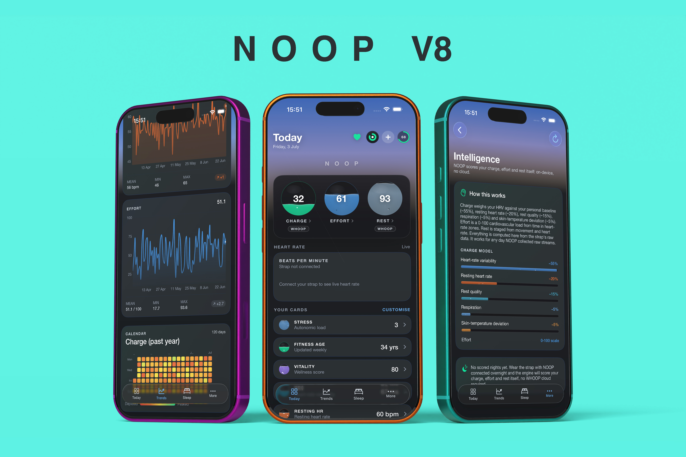
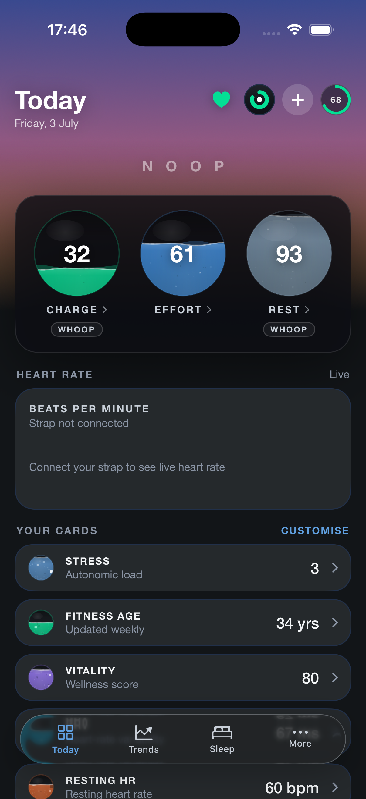

<p align="center">
  
</p>

<h1 align="center">NOOP AI</h1>

<p align="center"><b>Your WHOOP data, on your own devices, with a coach that actually remembers you.</b></p>

<p align="center">
  
  
  
  
  
  <a href="LICENSE"></a>
</p>

<p align="center">
  
</p>

---

## What you get

|  | |
|---|---|
| ⌚ **Your WHOOP, without WHOOP** | Pairs straight with a **WHOOP 4.0 or 5.0/MG** over Bluetooth. No WHOOP account, no subscription, nothing in the middle. |
| 📱 **iPhone and Mac** | Runs on **iOS 17+** and **macOS 13+**, from the same codebase. |
| 🤖 **A coach with a memory** | 22 tools it uses to look things up mid-answer, a goal, a plan you agreed to, and facts it remembers across months — not a chatbot bolted onto a dashboard. |
| 📈 **Deep health analysis** | Recovery, strain, sleep, HRV, readiness, training load and n-of-1 correlations — all computed **on your device**, from published methods. |
| 🔒 **No server, no account** | Everything lives in a database on your machine. The coach is the one thing that opens a socket, only with your own API key, only when you ask it something. |
| 🔄 **Close to upstream** | Tracks [ryanbr/noop](https://github.com/ryanbr/noop) directly, so protocol and analytics work lands here quickly. |

> **New here?** The coach is what makes this fork different — jump to **[The coach](#the-coach-)**.
> Everything else is upstream NOOP, which is excellent and deserves the credit.

---

## Contents

- [The coach](#the-coach-) — the reason this fork exists
- [What NOOP itself does](#what-noop-itself-does-) · [What leaves your device](#what-leaves-your-device-)
- [Quickstart](#quickstart-) · [What it looks like](#what-it-looks-like-)
- [About the fork](#about-the-fork-) · [Docs](#docs-)
- [Attribution](#attribution-) · [Disclaimer](#disclaimer-) · [License](#license-)

---

# The coach 🤖

Upstream ships a chat-with-your-own-API-key coach that receives one pre-baked block of text per
message. This fork turns that into something with a goal, a plan, a memory, and hands to go and
fetch its own data.

### 🔧 It looks things up while it answers

Instead of a fixed summary, the coach reaches for **22 tools** mid-sentence. Crucially,
`get_readiness` and `get_charge_drivers` read from the **exact same engines the Today screen uses**,
so its verdict can never contradict the number you're looking at.

- 🎯 `get_readiness` — the same push / maintain / rest verdict Today shows
- 🔬 `get_charge_drivers` — *why* today's Charge is what it is, term by term, never an invented reason
- 📈 `plot_metric` — draws a real chart inline in the chat
- 📝 `propose_plan` — suggests a session; it cannot book one
- ☕ `log_caffeine` / `log_journal` / `log_lab_marker` — **writes** to your real app data

That last group is the fun one: *"just had a double espresso"* becomes a real entry in the Caffeine
card. *"my Vitamin D came back at 38"* becomes a Lab Book marker. Same data, logged by talking.

### 🧠 It has a real memory

Most AI chat features either forget everything or dump everything into every prompt. This one works
more like a person's:

- **Facts have shape.** Each carries a category (goal, injury, preference, physiology, schedule) and
  an importance. **Pinned** facts — a serious injury, a hard constraint — ride along on every reply;
  the rest surface only when relevant to what you just asked.
- **It corrects itself.** Tell it your knee is fine now and the stale fact is rewritten, not stacked
  next to a contradiction. Near-duplicates merge instead of eating the memory budget.
- **It remembers conversations — including *when*.** Ask *"what did I ask you yesterday?"* and it
  searches by day, quoting your own questions back.
- **It tidies up cheaply.** Leaving a chat hands it to a small, cheap model (Haiku / gpt-4o-mini /
  Flash-Lite — you pick) for a one-line summary. Your expensive model never pays for housekeeping.

Every fact is visible and editable in Settings. Nothing is remembered that you can't see or delete.

### 🎯 It knows your goal, and stays honest about it

Set a target — a run, a consistency streak, sleep, weight, or free-text — and the coach stops
improvising. Up to five goals can run at once, weighed against each other.

- **Two safety checks, neither of which ever blocks you.** *Is the pace aggressive?* Measured as a
  percentage of your own body weight or volume per week, so the same 20 kg cut reads correctly at
  60 kg and at 160 kg — an aggressive pace asks for a one-line reason and remembers it. *Is it
  realistic?* Checked against your on-device VO₂max estimate — and for weight goals, always reported
  honestly as "no data to judge that on", because there isn't any.
- **It never plans your diet.** Training is the only lever it has, and it says so.
- **No invented percentages.** Progress is a real measurement against a real baseline, or nothing.
- **A goal whose date passes gets a look-back** — once, asking what you want to do with it, rather
  than a verdict on a number it hasn't checked.

### 📅 It proposes; you decide

The coach can suggest a session. It cannot schedule one. Every suggestion waits as a proposal until
you accept, decline, reschedule or swap it.

Swapping shows the consequence **before** you decide, computed from your own history rather than a
generic table: *"CrossFit at 10:00 instead of Zone 2 — about 18 points and 2 recovery days instead
of 6 and one. Tomorrow's projection drops from ~62 to ~45."* Skipping is one tap and a reason;
pain and illness are read back with context, not judgment, and a few skips never get a sport
permanently written off.

### 💬 The chat itself

| | |
|---|---|
| **Streams everywhere** | Token-by-token on **every** provider, with tool calls running inline — including local models, where it matters most. |
| **Says when it spoke first** | A daily brief or an unprompted nudge is labelled as such, and badged, so it never reads as a reply to a question you've forgotten asking. |
| **Recovers from failures** | Offline says *offline*; a rejected key offers the key screen; a rate limit counts down from the provider's own `Retry-After`. |
| **Searchable, pinnable history** | Full-text search across threads, pin the ones worth keeping, share any as Markdown. |
| **A closer look on demand** | Optionally set a heavier model for one question at a time — *"Look at this more closely"* on a reply you've already read. Off unless you configure it. |
| **In-chat charts** | Native trend charts drawn in the conversation, and they survive a relaunch. |
| **"Ask coach" on any card** | A sparkle on Today's rings and every card — a short, careful read of one number without leaving Today. |
| **A name and a face** | **Svea** or **Marv**, or your own name, symbol or photo — never leaving the device. Coaching *style* (Guardian / Friend / Commander) layers on top, changing tone only, never the methodology or the "I'm not a doctor" guardrails. |
| **Honest about cost** | Token counts and cache behaviour after every question, on every provider. |
| **Bring almost any model** | Anthropic, OpenAI, Google Gemini, OpenRouter, or any OpenAI-compatible endpoint — including a local Ollama or LM Studio server. |
| **English, Deutsch, Español, Français** | The coach's own UI is fully translated, on top of upstream's coverage. |

📖 **The deep version** → **[docs/COACH.md](docs/COACH.md)**: every tool's schema, the safety gates,
the plan book's state machine, the memory ranking, provider support, and the file map.

---

## What NOOP itself does ⌚

Everything in this section is **upstream [ryanbr/noop](https://github.com/ryanbr/noop)**, inherited
unchanged — credit belongs there and in [`docs/FEATURES.md`](docs/FEATURES.md).

- **Pairs directly with a WHOOP 4.0 or 5.0/MG strap over Bluetooth Low Energy.** WHOOP straps don't
  appear in *Settings → Bluetooth*; NOOP finds them on their own advertising profile.
- **Computes its own scores on-device, from published methods**: **Charge** (recovery), **Effort**
  (strain) and **Rest** (sleep quality) — an energy economy you wake with, spend, and rebuild
  overnight — plus HRV, resting heart rate, SpO₂, respiration and skin temperature. Honest
  approximations, explicitly **not WHOOP's own scores**.
- **Everything lives in an on-device SQLite database.** Import a WHOOP or Apple Health export for
  instant history, or just wear the strap and let it build.
- **Automatic Apple Health sync** (HealthKit background delivery), so the coach always reasons over
  fresh data.

## What leaves your device 🔒

Worth being precise about, because "AI" and "private" rarely share a sentence:

- **The app itself is fully offline.** Strap data, database, scores, goals, plan, memory and chat
  history are all local. There is no NOOP server and no account.
- **Only the coach opens a socket** — only when you send a message, only to **your own provider with
  your own key**, and only if you've turned data access on. Turn it off and the coach still works;
  it just doesn't see your numbers.
- **Summaries, never raw signal.** Derived daily numbers and short text — never raw R-R streams or
  sensor buffers.
- **You can go fully local.** Point the Custom provider at Ollama or LM Studio and nothing leaves
  your network at all.

More: [`docs/PRIVACY_SECURITY.md`](docs/PRIVACY_SECURITY.md).

## Quickstart 🚀

You'll need a Mac with **Xcode 26+** and [`xcodegen`](https://github.com/yonaskolb/XcodeGen)
(`brew install xcodegen`). For the iOS app you also need a **physical iPhone** — Bluetooth and
HealthKit don't exist in the Simulator.

```bash
git clone https://github.com/DX23876/noop.git NOOP-AI
cd NOOP-AI
xcodegen generate     # project.yml is the source of truth; the .xcodeproj is generated
open Strand.xcodeproj
```

**iPhone** — pick the `NOOPiOS` scheme → select your iPhone → *Signing & Capabilities* → set your
Team → ⌘R. On the phone, trust the certificate under *Settings → General → VPN & Device Management*.
A free Apple ID works, with two small trade-offs (the Watch app/widget step back, and the build
expires after 7 days) — 👉 **[docs/DETAILS.md](docs/DETAILS.md#quickstart-the-signing-fine-print)**.

**Mac** — pick the `Strand` scheme and ⌘R.

Then: pair your strap → grant Apple Health access → open **Coach** → paste your API key → optionally
give your coach a name, a face and a goal.

## What it looks like 📸



<table>
<tr>
<td width="50%" align="center">
<br>
<b>Svea</b>
</td>
<td width="50%" align="center">
<br>
<b>Marv</b>
</td>
</tr>
<tr>
<td colspan="2" align="center"><i>Pick a ready-made coach, or make your own — any name, symbol or photo.</i></td>
</tr>
</table>

<p align="center">
  
</p>

<!-- TODO: add captures of the coach chat, the guided goal setup and Goal & Journey. Three such
     images were referenced here previously (docs/assets/screenshots/*.png) but never existed, so
     GitHub rendered three broken-image icons. Re-add each row only once its file is committed. -->

▶️ Short demo video: [`marketing/NOOP-demo.mp4`](marketing/NOOP-demo.mp4).

## About the fork 🍴

NOOP AI is a **personal fork** of [ryanbr/noop](https://github.com/ryanbr/noop) — not a competitor,
and not a rebrand that hides where it came from. Every protocol decoder, analytics formula and pixel
of the design system comes from upstream; this fork adds **a much bigger coach** on top, in its own
files, without rewriting upstream logic. Apple platforms (iOS + macOS) are what it builds and tests;
the Android tree is carried untouched so `git merge upstream/main` keeps working.

**Just want a great WHOOP app?** Use [ryanbr/noop](https://github.com/ryanbr/noop) — macOS, Android
and iOS, actively maintained, and the right answer for most people. This fork is for the narrow case
where you want the coach pushed further than a cross-platform project could reasonably justify.

👉 The full rationale, and the upstream-sync mechanics:
**[docs/DETAILS.md](docs/DETAILS.md#why-a-fork-not-a-contribution-upstream)**.

## Docs 📚

- **[docs/COACH.md](docs/COACH.md)** — the coach in full: tools, goal gates, plan book, memory, providers.
- **[docs/DETAILS.md](docs/DETAILS.md)** — fork rationale, the complete tool table, architecture,
  signing fine print, upstream sync, and the docs index.
- **[docs/PRIVACY_SECURITY.md](docs/PRIVACY_SECURITY.md)** — the data posture in detail.

---

## Attribution 🙏

NOOP AI is a fork of **[NOOP](https://github.com/ryanbr/noop)** by ryanbr — please treat that
repository as the canonical project, not this fork. NOOP itself stands on community
protocol-documentation work: **`johnmiddleton12/my-whoop`** (WHOOP 4.0 BLE protocol),
**`b-nnett/goose`** (WHOOP 5.0/MG BLE protocol), **`groue/GRDB.swift`** (SQLite persistence), and
**`weichsel/ZIPFoundation`** (export unzipping).

NOOP contains no WHOOP proprietary code, firmware, logos, or assets. Full detail in
**[docs/DETAILS.md](docs/DETAILS.md)** and [`ATTRIBUTION.md`](ATTRIBUTION.md).

## Disclaimer ⚠️

NOOP AI is an independent, unofficial, non-commercial interoperability project. It is **not
affiliated with, endorsed by, or connected to WHOOP, Inc.** All references to "WHOOP" are nominative.

**NOOP is not a medical device.** Heart rate, HRV, recovery, strain, sleep stages, SpO₂, respiratory
rate and skin temperature are **approximations** from published methods — not clinically validated,
not medical advice. The AI coach is not a doctor and must not be used to diagnose or treat. Consult a
qualified professional. Provided **as-is, with no warranty**, for **personal and educational use**.
See [`DISCLAIMER.md`](DISCLAIMER.md).

## License 📄

Source-available under the [PolyForm Noncommercial License 1.0.0](LICENSE): **free for personal and
other non-commercial use** — read it, run it, fork it. Commercial use is not granted. This fork keeps
the upstream `LICENSE` and `Copyright 2026 NoopApp` notice intact, per NOOP's mirroring terms;
bundled dependencies keep their own licenses (see [`NOTICE`](NOTICE)).
