<p align="center">
  
</p>

<h1 align="center">NOOP AI</h1>

<p align="center"><b>Your WHOOP data, on your own devices, with a coach that remembers.</b></p>

<p align="center">
  
  
  
  
  <a href="LICENSE"></a>
</p>

<p align="center">
  
</p>

<p align="center">
  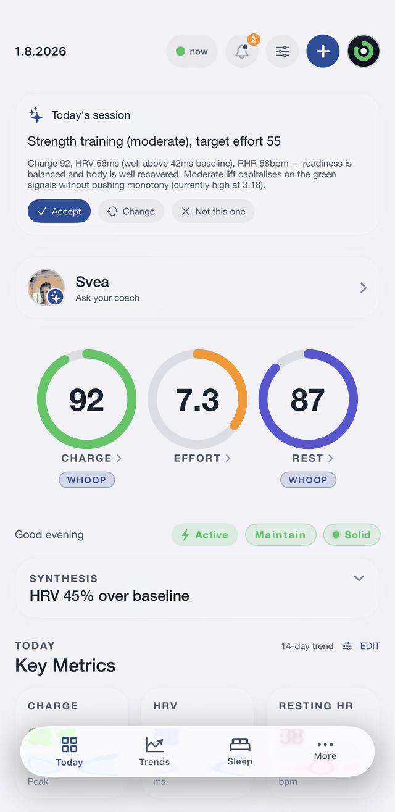
  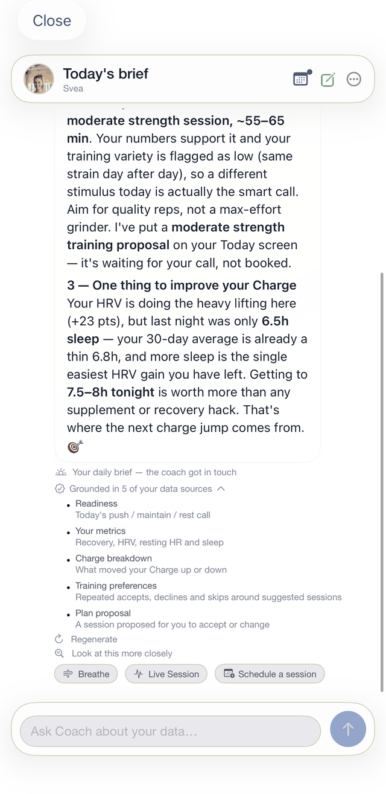
  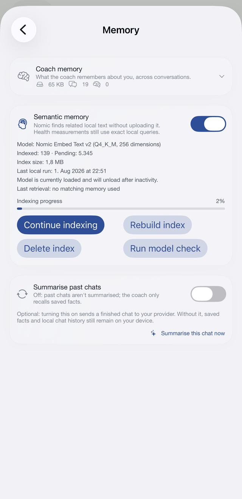
</p>
<p align="center">
  <sub>Today · the daily brief and the sources behind it · memory that runs on the phone</sub>
</p>

---

<!--
MAINTAINER NOTE — update this small release section for every beta or public release:
1. Change the badge and heading version.
2. Keep three or fewer concrete highlights.
3. Move shipped items out of “In development” and link the matching release note.
-->

## What this fork adds

NOOP AI stays close to [RyanBR's NOOP](https://github.com/ryanbr/noop) for the strap protocol,
on-device analytics, storage and shared design system. The code below is the additional,
Apple-first layer maintained in this fork:

### 🤖 A real coaching system, not just a chat box

A configurable identity and coaching style, streaming replies, model-specific history budgets and
26 consent-gated tools that can read local summaries, explain readiness, draw charts, propose plans
and write only the logs you explicitly request. Provider connections support Anthropic, OpenAI,
Gemini, OpenRouter and custom OpenAI-compatible endpoints with your own key; tool calling is enabled
where the selected provider and model support it. [Coach architecture →](docs/fork/COACH.md)

### 🧠 Private long-term memory on the device

Hybrid keyword and semantic retrieval over approved facts, your own chat turns and selected journal
context. The Nomic embedding model runs locally on iPhone; raw sensor streams and numerical health
histories are never embedded. Consent can be withdrawn at any time, and the derived index can be
rebuilt or deleted. [SemanticMemory package →](Packages/SemanticMemory/)

### 🎯 Goals, Journey and a plan you control

One structured goal with feasibility and safety checks, progress based on actual evidence, milestones
without invented streaks, and weekly proposals you can accept, decline, reschedule, swap or skip.
A model proposal never silently becomes your schedule.

### 🔐 Purpose-by-purpose data consent

Essentials, Personal and Deep Insights presets make setup simple; Expert mode exposes the individual
grants. Sensitive journal topics always require a separate decision, and unavailable grants remove
the corresponding tools before a request is sent. [Privacy model →](docs/PRIVACY_SECURITY.md)

### 🔔 Proactive coaching with a local history

Optional daily briefs, check-ins and goal reviews live in the Coach; plan proposals and important
body/goal signals also feed the in-app bell, so useful events remain visible even when iOS cannot
show a notification banner.

### 🧪 Review-first health workflows

Lab reports can be read from a text PDF or on-device photo OCR, but only recognised marker candidates
you confirm become Lab Book entries. Files, OCR text and unconfirmed values are not retained.

### 🍎 Apple-first interface and distribution

A redesigned Today experience, configurable Coach entry points, compact-iPhone chat handling,
fork-added surfaces covering upstream's full Apple language matrix, and an unsigned AltStore/SideStore
beta that is signed only with the Apple ID you choose.

The upstream base and the fork additions remain intentionally separated in code so upstream protocol,
analytics and safety fixes can continue to be merged without rewriting the coaching layer.

## Latest release — 10.1.0

The first release of this fork on the 10.x line. Builds are no longer branded "DX Beta"; the `-dx`
suffix survives only in the tag, because upstream tags `vX.Y.Z` in the same namespace this fork
fetches into.

- **Set your own heart-rate zones.** Percentages of your maximum, or absolute beats from a threshold
  test. They change the live readout, a workout's zone split and what the coach prescribes — never
  your Effort score, which stays on its published method.
- **The coach can no longer prescribe an effort your session cannot produce.** A target is computed
  from the zone and the duration against your own bands before the coach may quote it.
- **No morning brief on a night your strap hasn't finished sending.** It waits and offers the sleep
  editor, instead of planning your day on a wrong wake time.

Read the full [10.1.0 notes](docs/fork/releases/v10.1.0.md).

Before it: [9.3.3](docs/fork/releases/v9.3.3-dx-beta.md) brought the widgets back to the sideload
download, and [9.3.2](docs/fork/releases/v9.3.2-dx-beta.md) corrected three faults feeding wrong
numbers into HRV.

## In development

- **Android is gone from this fork.** The `android/` tree was removed in August 2026 — nobody here
  develops it, and a tree nobody builds only rots. This fork is iOS and macOS. Upstream
  [ryanbr/noop](https://github.com/ryanbr/noop) still ships the Android app; that is where to look
  for it.
- **More practical alert history.** The inbox will keep evolving around events that actually happened,
  rather than becoming a second copy of scheduled reminders.

## A look inside

<table>
  <tr>
    <td width="33%" valign="top">
      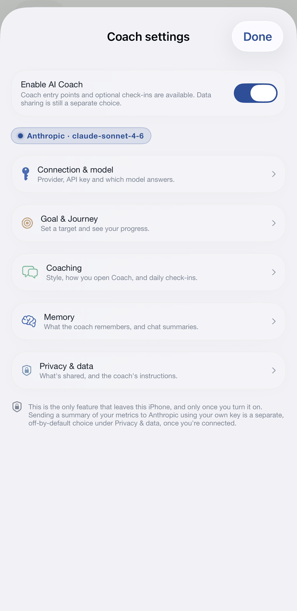
      <br><sub><b>The coach, in one place.</b> Nothing reaches a provider until you switch it on, and sharing your metrics stays a separate decision after that.</sub>
    </td>
    <td width="33%" valign="top">
      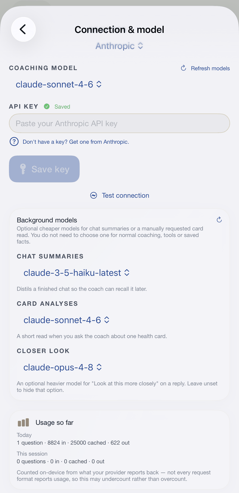
      <br><sub><b>Your provider, your key, your model.</b> Cheaper background models for summaries are optional, and the token count is tallied on the device.</sub>
    </td>
    <td width="33%" valign="top">
      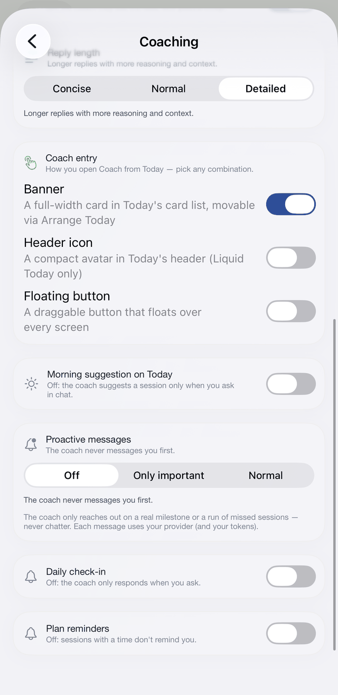
      <br><sub><b>Where it may appear, and whether it may speak first.</b> Banner, header icon or floating button — and proactive messages can be silenced entirely.</sub>
    </td>
  </tr>
  <tr>
    <td valign="top">
      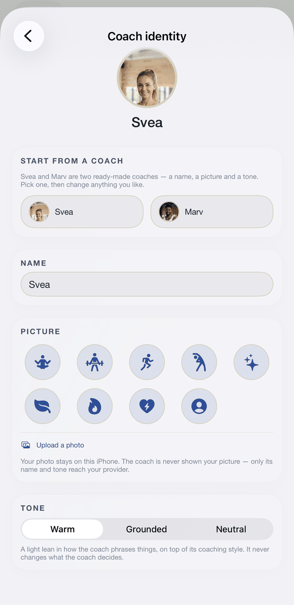
      <br><sub><b>Two ready-made coaches, or your own.</b> Name, picture and tone are yours to set; the picture never leaves the phone.</sub>
    </td>
    <td valign="top">
      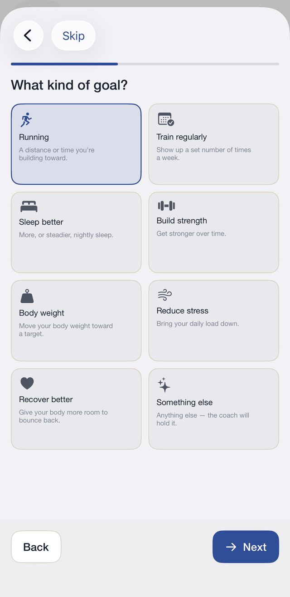
      <br><sub><b>One goal at a time.</b> Picked from what your data can actually track, then checked for feasibility before it becomes a plan.</sub>
    </td>
    <td valign="top">
      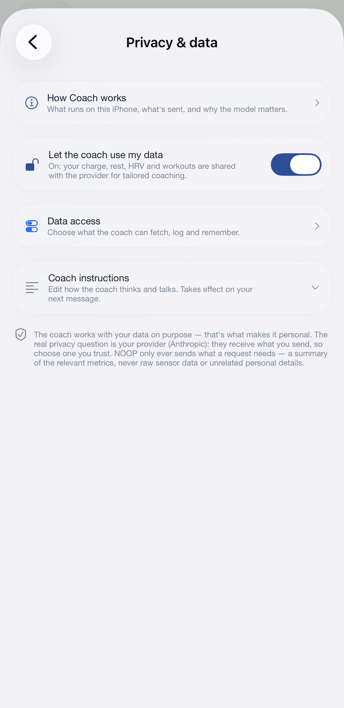
      <br><sub><b>Grant by grant.</b> What the coach may read, log and remember — and the instructions it runs on, in plain text you can edit.</sub>
    </td>
  </tr>
  <tr>
    <td valign="top">
      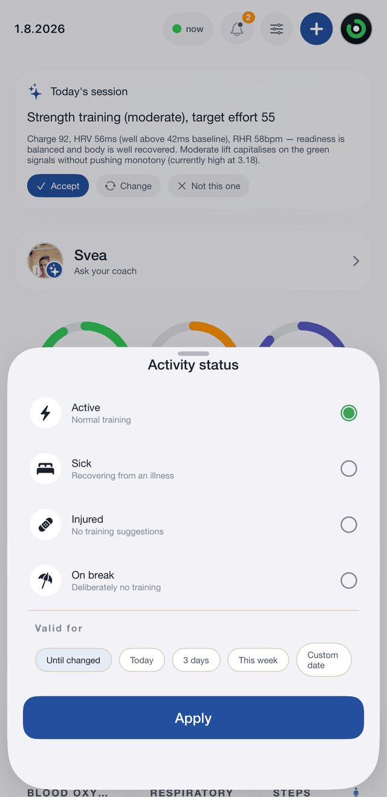
      <br><sub><b>Sick, injured, on a break.</b> Say so once and the app stops proposing training until the period you chose runs out.</sub>
    </td>
    <td valign="top">
      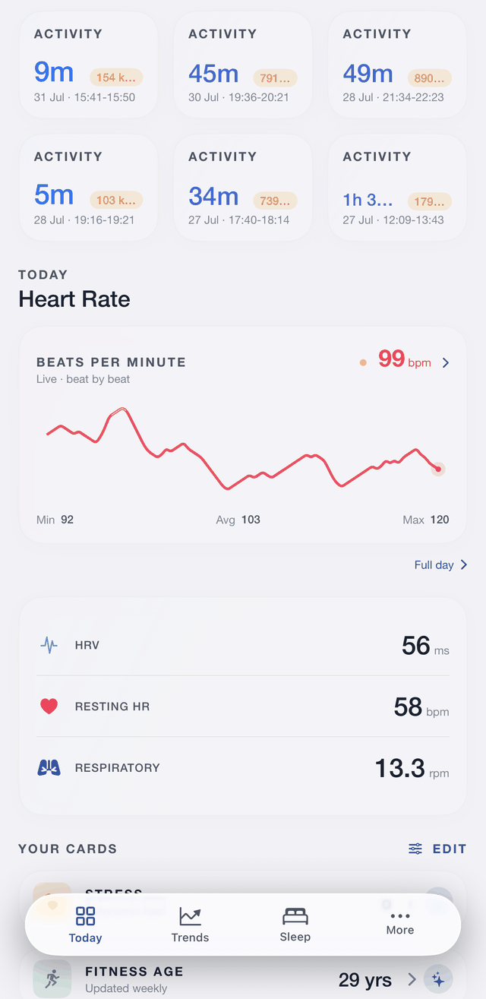
      <br><sub><b>Recent sessions and a live pulse.</b> Beat by beat while the strap is connected, with the night's vitals directly below.</sub>
    </td>
    <td valign="top">
      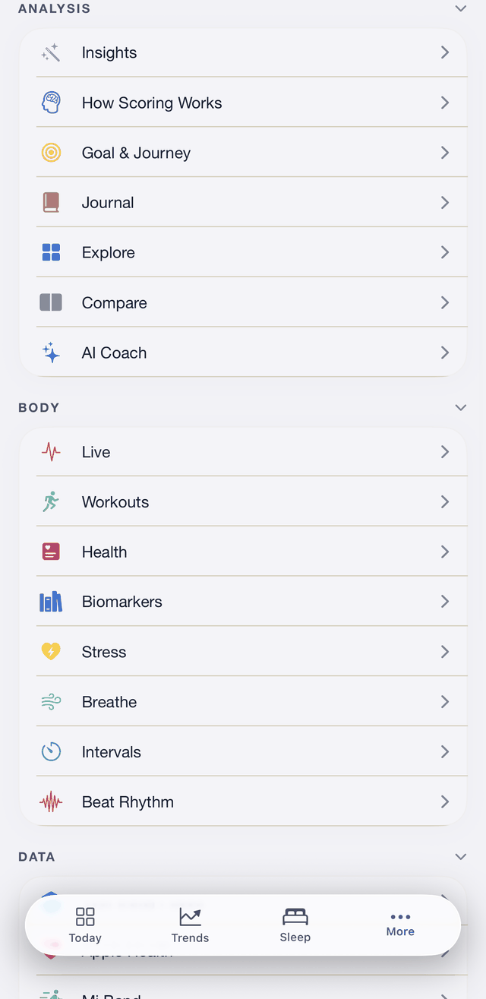
      <br><sub><b>Everything else.</b> Insights, journal, biomarkers, intervals and the import screens, one tap from the tab bar.</sub>
    </td>
  </tr>
</table>

<sub>Screenshots: 9.3.1 DX Beta on iPhone, English interface, light appearance.</sub>

## Download and install

### iPhone and iPad

The iOS build is an **unsigned IPA on purpose**. Add the source below in AltStore or SideStore, then
the sideloader signs the app locally with the Apple ID you choose. NOOP AI never receives your Apple ID
or a signing certificate.

**Source URL:**

```
https://raw.githubusercontent.com/DX23876/noop/main/altstore-source.json
```

- **AltStore:** Browse → **+** → paste the source URL → add NOOP AI.
- **SideStore:** Sources → **+ Add Source** → paste the same URL → install NOOP AI.
- **Adding the source is the reliable route, not a convenience.** The IPA is ~345 MiB (the on-device
  coach model is most of it), and handing a file that size to the sideloader through the iOS share
  sheet routinely gets the app killed for memory mid-import — it looks like AltStore "closing
  itself". Installed from the source, the sideloader downloads it directly and that step never
  happens. From a computer, AltServer or Sideloadly is equally fine.
- Prefer a direct file? Download `NOOP-ios-unsigned-v10.1.0-dx.ipa` from the
  [10.1.0 release](https://github.com/DX23876/noop/releases/tag/v10.1.0-dx). It includes the
  Home/Lock-Screen **widgets**, which AltStore/SideStore sign along with the app.
- Need the **Apple Watch** app? The same release also contains
  `NOOP-ios-full-unsigned-v10.1.0-dx.ipa`, which adds the Watch app and complication. It wants a
  signer or paid Developer team that can provision all of it together — sideloaders install an
  embedded watchOS bundle unreliably, and a failure there costs you the whole install, which is why
  the AltStore source stays on the watch-less IPA.
- **You do not need to remove another NOOP first.** This fork installs under its own bundle id
  (`com.noopapp.noopai`), so upstream's app and this one coexist. On the Home Screen this one is
  named **NOOP AI**; upstream's is **NOOP**.

See [the iOS install guide](docs/IOS.md) for the free-Apple-ID limits, widget notes, and build-from-source
instructions.

### Mac

From 9.3.0 the release carries a packaged macOS build: download
`NOOP-macos-v10.1.0-dx.zip` from the
[10.1.0 release](https://github.com/DX23876/noop/releases/tag/v10.1.0-dx), unzip it, then
**right-click → Open** the first time (it is ad-hoc signed, not notarised, so a double-click is blocked).

The bundle is universal — Apple Silicon and Intel. Ad-hoc signing is what lets macOS bind the Bluetooth
permission to the app; after an update macOS may ask you to re-approve Bluetooth, because the code
identity changes with every build.

### Platform status

| Platform | Status | Distribution |
|---|---|---|
| iOS / iPadOS | 10.1.0 | AltStore, SideStore, or build from source |
| macOS | 10.1.0 | Packaged `.zip` in the release, or build with Xcode |
| Android | Removed from this fork | Upstream [ryanbr/noop](https://github.com/ryanbr/noop) ships it |

## The NOOP foundation retained

| | |
|---|---|
| ⌚ **Own your strap data** | Connect directly to a WHOOP 4.0 or 5.0/MG over Bluetooth. No WHOOP account, subscription, or cloud relay. |
| 📈 **Compute locally** | Charge, Effort, Rest, sleep, HRV, heart rate, recovery trends, and correlations are calculated and stored on your device. |
| 🔒 **Keep control** | No telemetry, no NOOP account, and no server. The optional coach only contacts the provider and API key you configure when you send a message. |
| 📬 **See what happened** | Today and the bell keep daily signals, important status, and recent alerts visible without turning every event into noise. |

## Privacy, precisely

NOOP AI is offline-first. Your strap data, database, scores, history, goals, coach memory, and plans
stay on your device. The optional AI coach is the only feature that can make a network request, and it
does so only when you choose a provider, provide your own key, and send a message.

More detail: [Privacy and security](docs/PRIVACY_SECURITY.md).

## Build from source

You need a Mac with Xcode 26+ and [XcodeGen](https://github.com/yonaskolb/XcodeGen).

```bash
git clone https://github.com/DX23876/noop.git NOOP-AI
cd NOOP-AI
Tools/bootstrap-nomic.sh   # once: downloads + checksums the coach model and llama.cpp runtime
xcodegen generate
open Strand.xcodeproj
```

- `Tools/bootstrap-nomic.sh` must run **before** `xcodegen generate`. It installs
  `Vendor/Nomic/llama.xcframework` (which the iOS target links) and the pinned embedding model into
  `Vendor/Nomic/Resources`, whose contents XcodeGen enumerates at generation time. Skip it and the
  iOS build fails to find the framework; run it after generating and the app builds with the coach
  runtime but no model to load. Neither binary is stored in git; later builds reuse the verified
  local copies.
- Choose **NOOPiOS** and a physical iPhone to build iOS.
- Choose **Strand** to build macOS.
- There is no Android target here; `docs/ANDROID.md` is kept for the upstream tree it describes.

## Documentation

- [iOS install and build guide](docs/IOS.md)
- [Build and signing guide](docs/BUILD.md)
- [Coach guide](docs/fork/COACH.md)
- [Feature reference](docs/FEATURES.md)
- [Privacy and security](docs/PRIVACY_SECURITY.md)
- [Contributing](docs/CONTRIBUTING.md)

## About the project

NOOP AI is a personal fork of [ryanbr/noop](https://github.com/ryanbr/noop). The upstream project
deserves credit for the protocol, analytics, and design-system foundations; this fork develops the
local coach and Apple-first beta distribution independently. It is an unofficial, non-commercial
interoperability project and is not affiliated with WHOOP.

## Disclaimer

NOOP AI is not a medical device. Its health and training values are on-device estimates, not clinical
advice or diagnosis. Use it as a personal tool and consult a qualified professional for medical decisions.

## License

Source-available under the [PolyForm Noncommercial License 1.0.0](LICENSE). See [NOTICE](NOTICE) and
[ATTRIBUTION.md](ATTRIBUTION.md) for bundled dependency and upstream credits.
