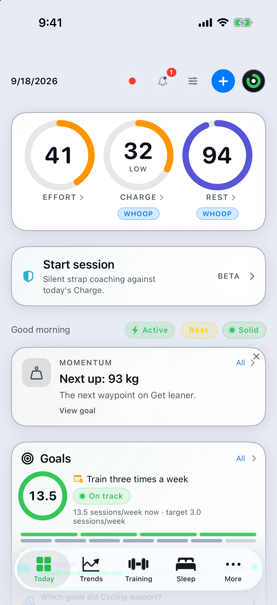
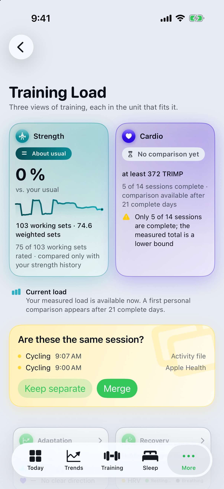
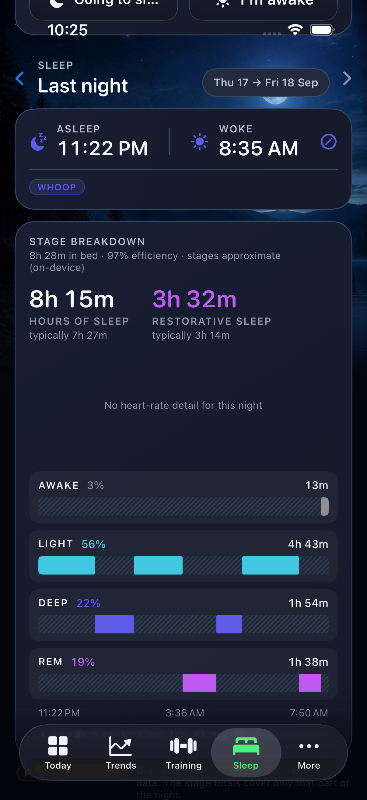
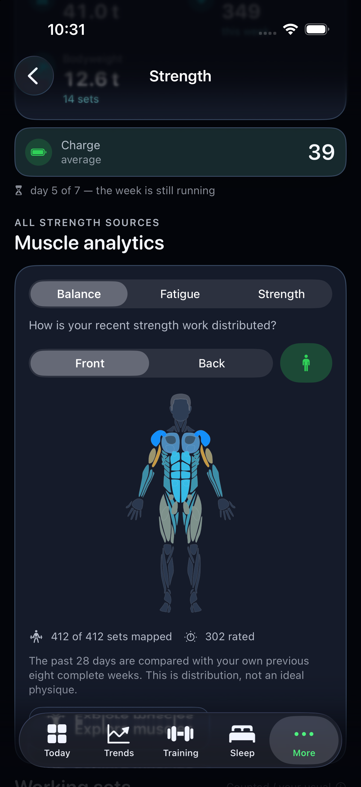
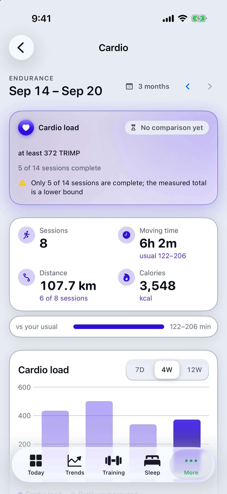
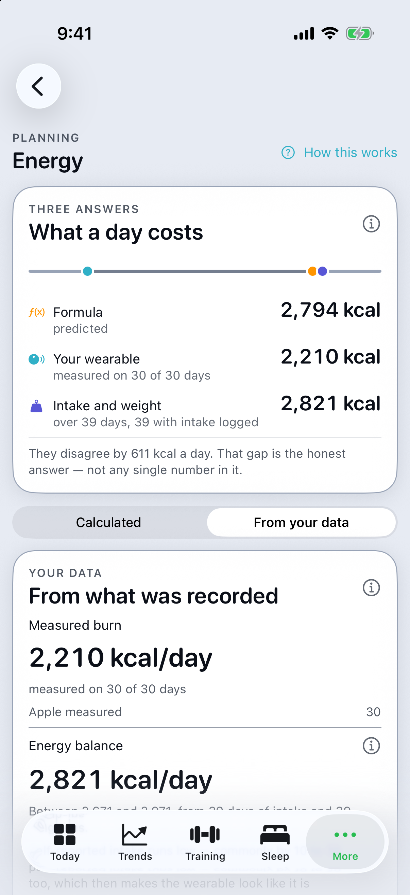
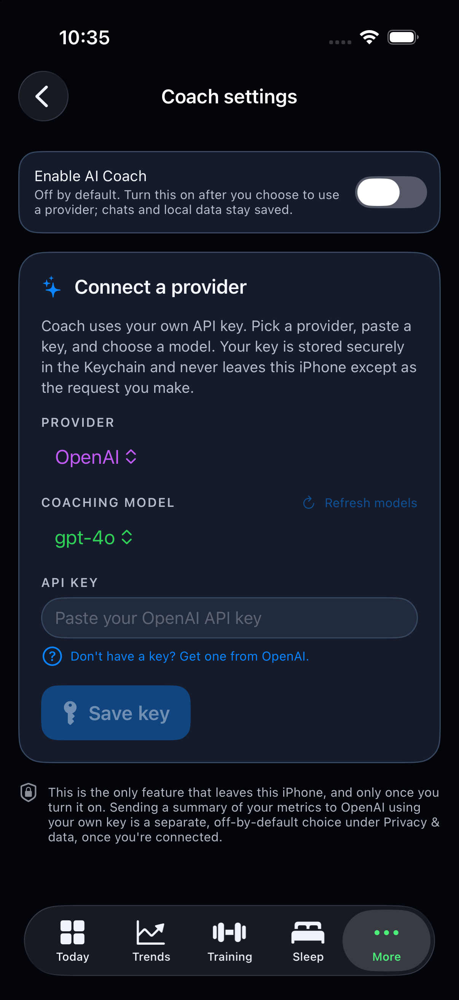
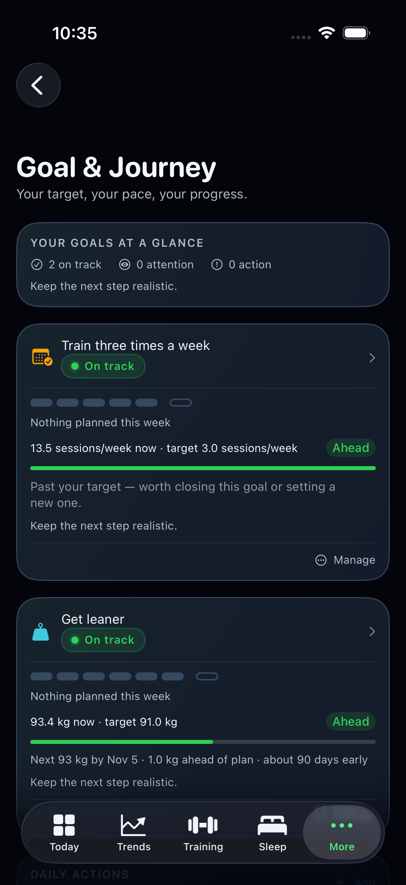

<p align="center">
  
</p>

<h1 align="center">NOOP AI</h1>

<p align="center"><b>Your WHOOP data, on your own devices, with a coach that remembers.</b></p>

<p align="center">
  
  
  
  
  <a href="LICENSE"></a>
</p>

<p align="center">
  
  
  
</p>
<p align="center">
  <sub>Today, the redesigned Training Load, and Sleep — all computed on the device you're holding</sub>
</p>

---

## Why NOOP AI

A WHOOP strap is remarkable hardware locked to WHOOP's own app, subscription and cloud. NOOP AI
talks to the strap directly over Bluetooth, computes Charge (recovery), Effort (strain), Rest,
sleep staging, HRV and training load **on your iPhone or Mac**, and keeps every number there. No
WHOOP account. No NOOP account either — there's nothing to sign into and nowhere to sign in to.

On top of that foundation, this fork adds a coach that can actually look at your data: an on-device
semantic memory of what you've told it, 26 tools it can use only with your consent, and goal
tracking that never quietly rewrites your plan for you. Bring your own API key (or run a fully
local model) and the coach reads your Charge, sleep and training history to have an informed
conversation — or don't configure one at all, and NOOP is a complete recovery and training app
without it.

It ships the way it's built: an unsigned iOS build you sideload with your own Apple ID, and a
Mac app you build or download directly. No App Store review, no App Store account, no telemetry
reporting any of this back.

## Feature tour

<table>
<tr>
<td width="50%" valign="top">

</td>
<td width="50%" valign="top">

### Today, your way

Three presentations of the same day — Classic rings, a Liquid Design glass treatment, or a dense
Overview grid — pick whichever reads best to you in Settings › Appearance. Recent workouts, a
live beat-by-beat heart rate card while the strap is connected, and HRV / resting heart rate /
respiratory rate sit right below the rings, with a proposed session and the coach's take on the
day when you want it.

</td>
</tr>
<tr>
<td width="50%" valign="top">

</td>
<td width="50%" valign="top">

### Sleep, read honestly

A reconstructed hypnogram for last night, stepping back through every earlier night you've
recorded. Stage minutes, efficiency, a "vs typical" tile grid for performance, consistency, hours
against your personal need, and sleep debt that decays instead of compounding forever. A
"may be incomplete" badge now reflects how short the night actually was, not just thin motion data.

</td>
</tr>
<tr>
<td width="50%" valign="top">

</td>
<td width="50%" valign="top">

### Training Load, Cardio and Strength — rebuilt

Chronic load (fitness), acute load (fatigue) and the balance between them, as a proper long-horizon
chart — rebuilt this release on one shared design kit with dedicated colour lanes so Training Load,
Cardio and Strength read consistently at a glance. Cardiovascular load, strength load and
whole-session load stay in their own units; nothing here invents an "× usual" claim before there's
enough history to back it.

</td>
</tr>
<tr>
<td width="50%" valign="top">

</td>
<td width="50%" valign="top">

### A native strength log — 1,324 exercises offline

Log sets directly in NOOP: routines, supersets, unilateral work, RIR, rest timers and plate
loading, with a body-based muscle picker over one shared exercise catalogue. Balance, Fatigue and
Strength views share one detailed muscle map so working-set distribution, remaining stimulus and
e1RM trends all read off the same taxonomy. FitNotes, Strong and Hevy imports join the same
history without duplicating overlapping sets.

</td>
</tr>
<tr>
<td width="50%" valign="top">

</td>
<td width="50%" valign="top">

### Cardio that keeps recording in the background

Live cardio recording continues while NOOP is backgrounded, the running session shows on the Lock
Screen and in the Dynamic Island, and starting a workout from Live, Workouts or a Quick Action
always resumes the same session — no more losing track of which screen "owns" the workout you're
mid-way through.

</td>
</tr>
<tr>
<td width="50%" valign="top">

</td>
<td width="50%" valign="top">

### Body weight and energy, honestly sourced

Weight history and trends get their own card. Daily energy expenditure blends NEAT, a personal
forecast curve and active-only calibration, is always source-aware (it says whether a number came
from WHOOP, Apple Health, or an estimate), and offers an opt-in Apple Watch calibration step rather
than silently trusting one device over another.

</td>
</tr>
<tr>
<td width="50%" valign="top">

</td>
<td width="50%" valign="top">

### A coach that can see your data — with your permission, tool by tool

Bring your own API key (Anthropic, OpenAI, Gemini, OpenRouter or a custom OpenAI-compatible
endpoint) or run a fully local model. The coach reads through 26 individually consent-gated tools —
biometrics, sleep, workouts, stress, energy, goals — and can *propose* a session or a goal setup,
never silently apply one. An on-device semantic memory (Nomic embeddings, nothing sent to a
server) lets it recall what you've told it without re-explaining yourself every time.

</td>
</tr>
<tr>
<td width="50%" valign="top">

</td>
<td width="50%" valign="top">

### Goals with no invented percentages

Up to five active goals — run, consistency, sleep, strength, weight or a custom one — checked for
feasibility before they become a plan. The Journey page shows a measured percentage only when a
real baseline and target exist; otherwise it says plainly what's actually known. Milestones are
facts (a real recovery uptrend, your longest run), never a streak counter that punishes a sick day.

</td>
</tr>
<tr>
<td colspan="2" valign="top">

### Every path in stays on the device

Direct Bluetooth to a WHOOP 4.0 or 5.0/MG, a WHOOP CSV export, Apple Health, FitNotes/Strong/Hevy
strength imports, GPX/TCX/FIT routes, and an experimental Oura ring pairing — all parsed and
merged locally. A `.noopbak` backup covers your whole history for moving to a new device or just
sleeping better about backups.

</td>
</tr>
<tr>
<td colspan="2" valign="top">

### Widgets, Watch, and a strap that syncs itself

Home Screen and Lock Screen widgets for the recovery ring, live heart rate and the coach's morning
brief; a watchOS companion with complications; and — new this release — a Sync Strap Shortcut, a
keep-screen-on option while syncing, and a sync Live Activity for the Lock Screen and Dynamic
Island.

</td>
</tr>
</table>

## Privacy, precisely

NOOP AI is offline-first. Your strap data, database, scores, history, goals, coach memory and
plans stay on your device. The optional AI Coach contacts only the provider you configure, only
when you ask it to; an experimental Oura history import and the manual/at-most-daily public-release
check are the only other network paths, and neither uploads raw sensor streams or gives NOOP a
server or account.

More detail: [Privacy and security](docs/PRIVACY_SECURITY.md).

## Install

### iPhone and iPad

The iOS build is an **unsigned IPA on purpose**. Add the source below in AltStore or SideStore,
and the sideloader signs the app locally with the Apple ID you choose — NOOP AI never receives
your Apple ID or a signing certificate.

**Source URL:**

```
https://raw.githubusercontent.com/DX23876/noop/main/altstore-source.json
```

- **AltStore:** Browse → **+** → paste the source URL → add NOOP AI.
- **SideStore:** Sources → **+ Add Source** → paste the same URL → install NOOP AI.
- Prefer a direct file? Download `NOOP-ios-unsigned-v11.8.1-dx.ipa` from the
  [11.8.1 release](https://github.com/DX23876/noop/releases/tag/v11.8.1-dx). It includes the
  Home/Lock-Screen **widgets**, which AltStore/SideStore sign along with the app.
- Need the **Apple Watch** app? The same release also carries
  `NOOP-ios-full-unsigned-v11.8.1-dx.ipa`, which adds the Watch app and complication. It wants a
  signer or paid Developer team that can provision all of it together — sideloaders install an
  embedded watchOS bundle unreliably, and a failure there costs you the whole install, which is why
  the AltStore source stays on the watch-less IPA.

See [the iOS install guide](docs/IOS.md) for the free-Apple-ID limits, widget notes, and
build-from-source instructions.

### Mac

Download `NOOP-macos-v11.8.1-dx.zip` from the
[11.8.1 release](https://github.com/DX23876/noop/releases/tag/v11.8.1-dx), unzip it, then
**right-click → Open** the first time (it is ad-hoc signed, not notarised, so a double-click is
blocked).

The bundle is universal — Apple Silicon and Intel. Ad-hoc signing is what lets macOS bind the
Bluetooth permission to the app; after an update macOS may ask you to re-approve Bluetooth,
because the code identity changes with every build.

### Build from source

You need a Mac with Xcode 26+ and [XcodeGen](https://github.com/yonaskolb/XcodeGen).

```bash
git clone https://github.com/DX23876/noop.git NOOP-AI
cd NOOP-AI
xcodegen generate
open Strand.xcodeproj
```

Choose **NOOPiOS** and a physical iPhone (or simulator) to build iOS, or **Strand** for macOS.

### Platform status

| Platform | Status | Distribution |
|---|---|---|
| iOS / iPadOS | 11.8.1 | AltStore, SideStore, or build from source |
| macOS | 11.8.1 | Packaged `.zip` in the release, or build with Xcode |
| Android | Not shipped by this fork | Use [ryanbr's upstream Android project](https://github.com/ryanbr/noop) |

## Under the hood

Core logic lives in cross-platform Swift packages, with each Apple platform as a thin app layer
over them:

| Layer | What lives here |
|---|---|
| Protocol | BLE frame parsing, CRC, command/event decoding — no CoreBluetooth, builds standalone |
| Storage | GRDB/SQLite persistence, migrations, streams |
| Analytics | HRV, recovery, strain, sleep, training load and correlation math — database-free, pure functions |
| Coach | Chat shell + providers (shared lineage with `ryanbr/noop`), extended with semantic memory, tool-calling and goal tracking (fork-only) |
| Import | WHOOP CSV, Apple Health, FitNotes/Strong/Hevy strength imports |
| Design system | SwiftUI palette, components and charts shared by every screen |

`ryanbr/noop`'s protocol reverse-engineering, analytics groundwork and design system are the base
this fork builds on. Where the two diverge — Apple-only distribution, the extended coach, native
training — is kept in its own layer so upstream fixes can keep merging in cleanly.

## Documentation

- [Complete documentation map](docs/README.md)
- [iOS install and build guide](docs/IOS.md)
- [Build and signing guide](docs/BUILD.md)
- [Coach guide](docs/fork/COACH.md)
- [Feature reference](docs/FEATURES.md)
- [Privacy and security](docs/PRIVACY_SECURITY.md)
- [Contributing](docs/CONTRIBUTING.md)

## About the project

NOOP AI is a personal fork of [ryanbr/noop](https://github.com/ryanbr/noop). The upstream project
deserves credit for the protocol, analytics and design-system foundations, and continues to
develop its own coach in parallel; this fork develops the extended coach (memory, tools, goals),
native training and Apple-first sideload distribution independently. It is an unofficial,
non-commercial interoperability project and is not affiliated with WHOOP.

## Disclaimer

NOOP AI is not a medical device. Its health and training values are on-device estimates, not
clinical advice or diagnosis. Use it as a personal tool and consult a qualified professional for
medical decisions.

## License

Source-available under the [PolyForm Noncommercial License 1.0.0](LICENSE). See
[NOTICE](NOTICE) and [ATTRIBUTION.md](ATTRIBUTION.md) for bundled dependency and upstream credits.
