<p align="center">
  
</p>

<h1 align="center">NOOP Forge</h1>

<p align="center">
  <b>Your strap. Your numbers. Your coach.</b><br>
  A complete recovery, sleep and training app for your WHOOP strap.<br>
  It runs entirely on your iPhone and Mac. No subscription, no account, no cloud.
</p>

<p align="center">
  <a href="https://github.com/DX23876/noop/releases/tag/v12.0.1-dx"></a>
  
  
  
  <a href="LICENSE"></a>
</p>

<p align="center">
  <a href="#what-is-noop-forge"><b>What is it?</b></a> ·
  <a href="#a-tour-of-the-app"><b>Tour</b></a> ·
  <a href="#noop-forge-or-ryanbrnoop"><b>Forge vs NOOP</b></a> ·
  <a href="#install"><b>Install</b></a> ·
  <a href="#privacy-in-plain-words"><b>Privacy</b></a> ·
  <a href="docs/README.md"><b>Docs</b></a>
</p>

<p align="center">
  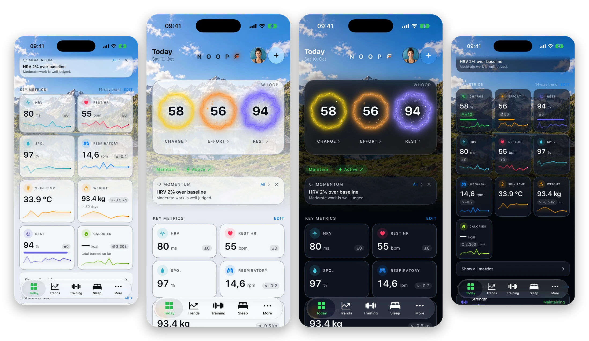
</p>
<p align="center"><sub>The screenshots come from the app's built-in demo mode with a made-up person and made-up numbers. Only the two coach screens show a real phone.</sub></p>

---

## What is NOOP Forge?

A WHOOP strap measures your heart around the clock. Normally those measurements go to WHOOP's servers,
and you pay a monthly fee to see what they mean.

**NOOP Forge reads the strap directly over Bluetooth and works everything out on your own phone.** How
well you recovered, how hard your day was, how you slept, how your training is going. Your data never
has to leave your device, and there is nothing to subscribe to.

<table>
<tr>
<td width="33%" valign="top">

### 🔒 Yours, completely

No WHOOP account, no NOOP account, no servers. All your history lives in one file on your phone. Delete
the app and the data goes with it. Move it to a new phone in one step.

</td>
<td width="33%" valign="top">

### 📏 Honest about every number

Each score tells you how it was made and where the data came from. When the app is not sure, it says
so instead of guessing.

</td>
<td width="33%" valign="top">

### 🏋️ More than a strap app

A full workout log, goals that adapt to real life, a body tracker, an energy page and an optional AI
coach, all in one place.

</td>
</tr>
</table>

### What you need

- A **WHOOP 4.0, 5.0 or MG** strap. You do not need an active WHOOP membership.
- An **iPhone or iPad** with iOS 17 or later, or a **Mac** with macOS 13 or later.
- About five minutes to install it with AltStore or SideStore (see [Install](#install)).

### How it works in three steps

1. **Pair the strap.** NOOP Forge connects over Bluetooth and pulls in what the strap has stored.
2. **Let it learn you.** After a few nights it knows your normal heart rate, sleep and recovery. From
   then on every number is compared with *your* normal, not with an average person's.
3. **Open the app in the morning.** Three scores tell you how your body is doing and what kind of day
   it is ready for.

Already have years of data? Bring them along from a WHOOP export, Apple Health, Strong, Hevy or
FitNotes.

> [!NOTE]
> **New in 12.0.1:** ECG readings on the WHOOP MG · weekly and monthly goals with their own page,
> widget and badges · one start screen for every workout and a new live workout view.
> [Read the release notes](docs/fork/releases/v12.0.1.md).

---

## A tour of the app

### Today: your day at a glance

<p align="center">
  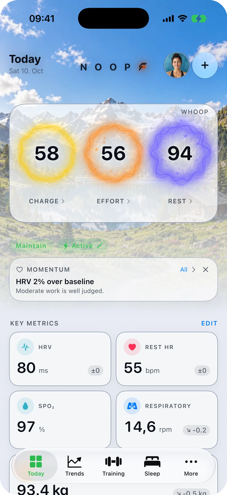
  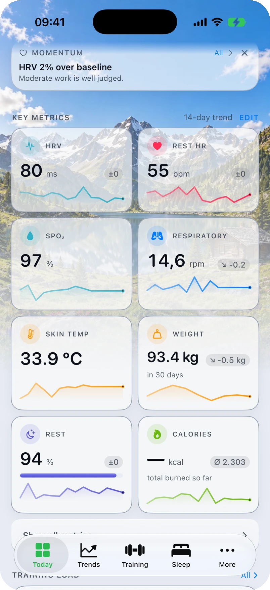
  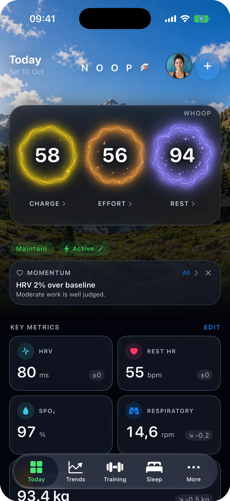
</p>

The first screen you see. Three rings show your **Charge** (how recovered you are), your **Effort**
(how much strain your day has had so far) and your **Rest** (how well you slept). Behind them sits a
landscape that changes with the time of day.

**The rings are alive.** In the default **Liquid** design each ring is a glowing band of fine
threads that moves slowly, as if it were breathing. The higher your score, the more little sparks
fill the circle. Effort glows brighter and breathes deeper once your day gets moderately hard. Tilt
the phone and the rings shift with it. When the app opens, the numbers count up from zero once. All of
this stops when you turn on Reduce Motion, use Low Power Mode or switch off the motion in the app, so
the rings then simply stand still.

Below the rings comes your **dashboard of tiles**. Each tile shows one number, for example heart rate
variability, resting heart rate, blood oxygen, breathing rate, skin temperature, weight or calories, with
a small line of the last 14 days. The little badge tells you how today compares with your own normal:
"±0" means a typical day, "↘ -0.5 kg" means your weight went down over 30 days. Numbers are only
coloured when something is really unusual for you.

Further down you find:

- **Momentum:** one short, useful note, for example "HRV 2% over baseline, moderate work is well
  judged".
- **Training Load:** whether your strength and cardio training are below, at or above your usual level.
- **Energy:** what you have burned so far today.
- **Your last workouts** and live heart rate while the strap is connected.
- **Your goals**, if you use them (see [Goals](#goals-that-bend-with-real-life)).

#### Make the dashboard yours

<p align="center">
  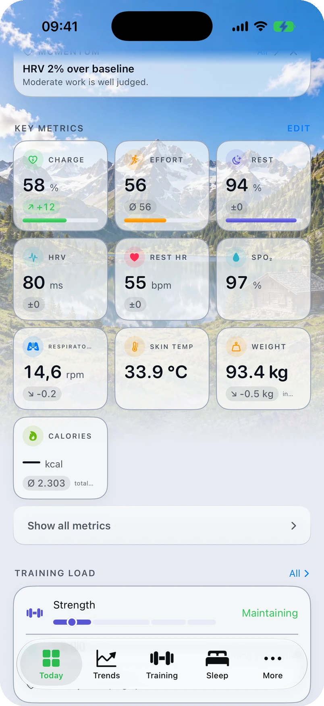
  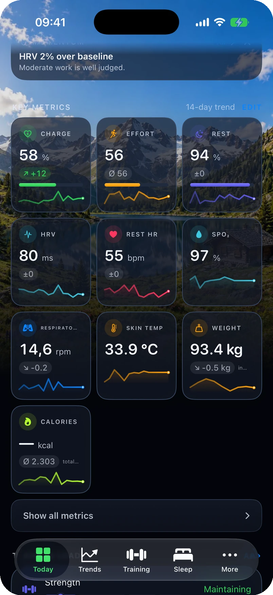
  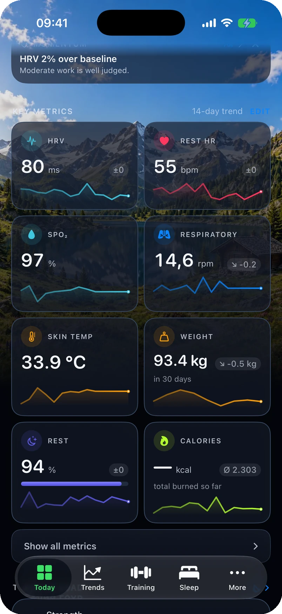
  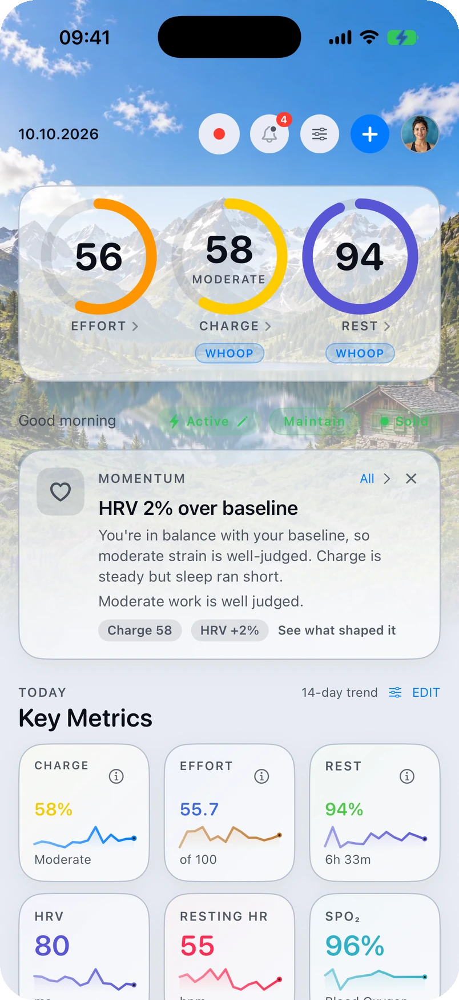
</p>

- **Pick your tiles** and their order: Charge, Effort, Rest, HRV, resting heart rate, blood oxygen,
  breathing rate, skin temperature, steps, weight and calories.
- **Two or three tiles per row**, with or without the 14-day trend line.
- **Light or dark**, and a landscape of your choice: Alps, coast or a painted meadow.
- **Show, hide and reorder every section.** Goals, the coach, journal reminders and everything else are
  optional.
- **Prefer it calmer?** Next to Liquid there is the **Classic** layout (last picture) with plain ring
  gauges and no animation, and a dense **Overview**. All three show the same numbers.

### The three scores, explained

<table>
<tr>
<td width="36%" align="center">
  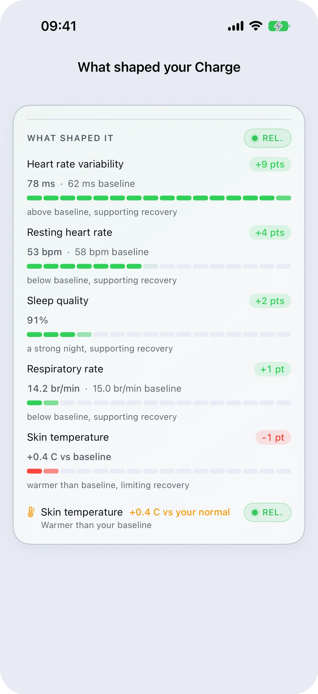
</td>
<td width="64%" valign="middle">

**Charge (0 to 100): how ready is your body?**
Measured every morning from your night. The biggest part is your heart rate variability (HRV), the
small differences between heartbeats. A rested body shows more variation. Resting heart rate, sleep
quality, breathing rate and skin temperature make up the rest. Tap the ring and the app shows exactly
which of these pushed your score up or down, and by how many points.

**Effort (0 to 100): how hard was your day?**
Grows through the day as your heart works above its resting level. A hard workout fills it quickly,
a walk slowly. It is scaled to you, so a hard day reads as hard *for you*.

**Rest (0 to 100): how good was your sleep?**
Compares the sleep you got with the sleep you needed, and looks at how deep and how steady it was.

</td>
</tr>
<tr>
<td width="64%" valign="middle">

**No black box.** A "How scoring works" page lists the exact weighting: heart rate variability about
55%, resting heart rate about 20%, sleep quality about 15%, breathing and skin temperature about 5%
each.

These scores are NOOP's own estimates built on published research. They are **not** WHOOP's scores
and will not match them exactly. In return you can see how every one of them is made.

</td>
<td width="36%" align="center">
  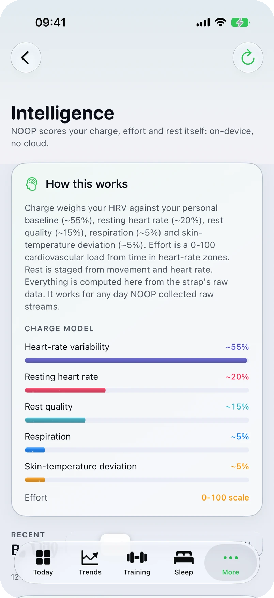
</td>
</tr>
</table>

### Sleep: what your night really was

<p align="center">
  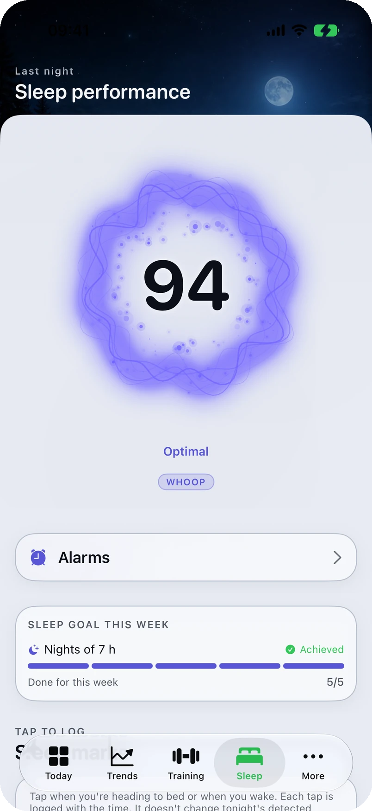
  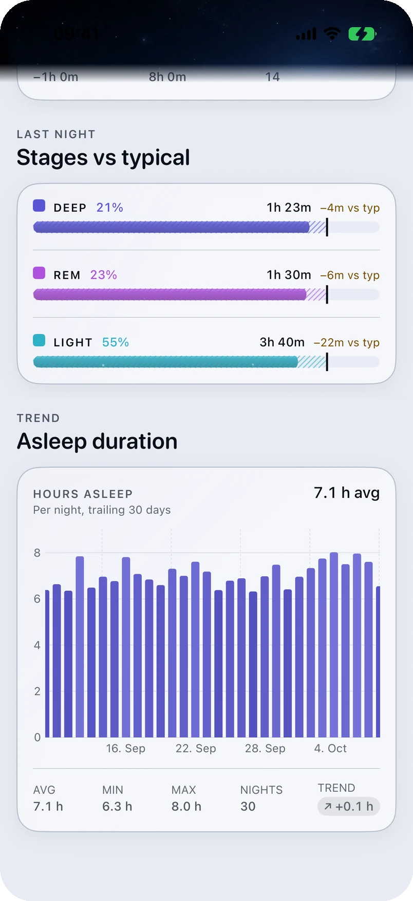
  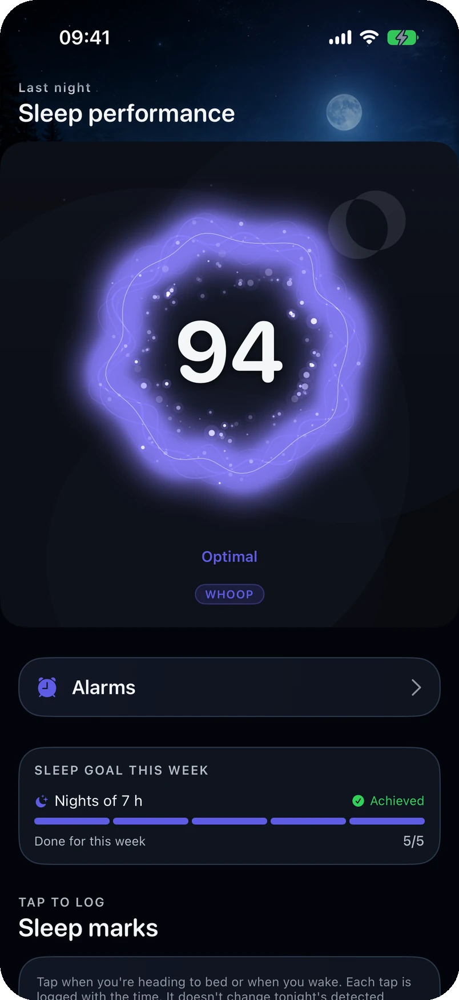
</p>

Every morning you see your sleep score, when you fell asleep and woke up, and how the night split into
**deep sleep, REM and light sleep**. Each stage is compared with your typical night, so you can see at
a glance whether you got less deep sleep than usual.

- **Sleep debt** tracks how much sleep you are short, and it shrinks again when you catch up.
- **A 30-night chart** shows whether you are sleeping more or less over time.
- **Flip back** to any earlier night.
- **Strap alarms** wake you with a silent buzz on the wrist, and an evening reminder tells you when
  to wind down.
- If the strap only recorded part of the night, the app says so instead of showing a misleading score.

### Trends and stress

<table>
<tr>
<td width="36%" align="center">
  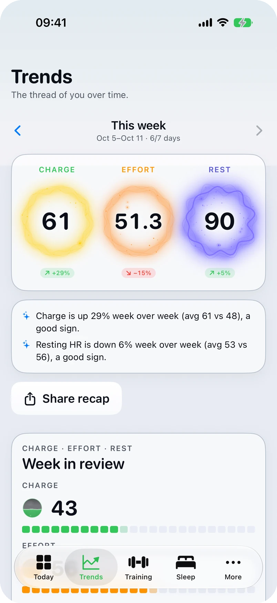
</td>
<td width="64%" valign="middle">

**Trends** shows your week next to the last one and puts the changes into words: "Charge is up 29%
week over week, a good sign." You can share a weekly recap as an image, look back months or years and
create a one-page PDF report, for example for your doctor or coach.

</td>
</tr>
<tr>
<td width="64%" valign="middle">

**Stress** shows how strained your nervous system is during the day, on a simple scale from 0 (calm)
to 3 (high). It compares your heart rate and HRV with your own normal, not with other people. Hours
when you were simply moving are marked as such, and "calm time" tells you how much of your recent
days were relaxed.

</td>
<td width="36%" align="center">
  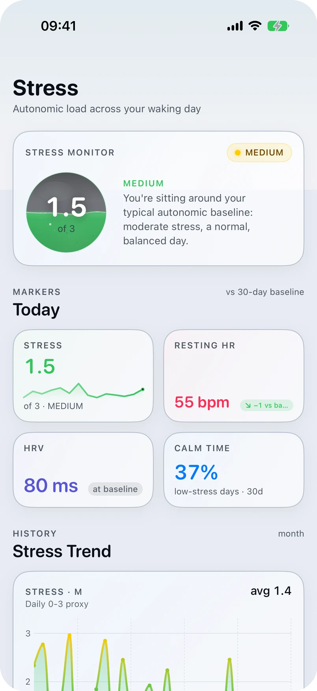
</td>
</tr>
</table>

### Training: plan it, start it, log it

<p align="center">
  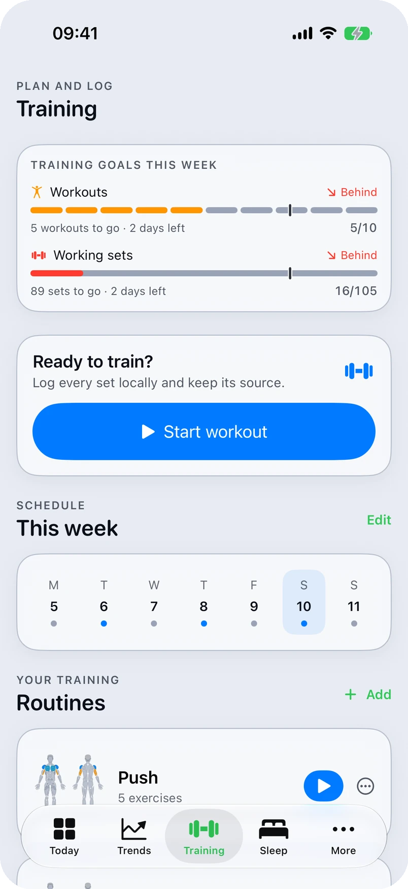
  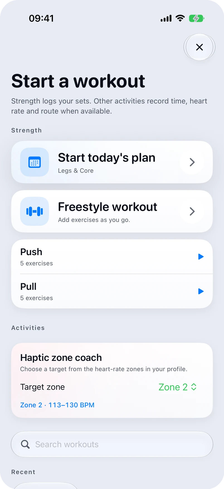
  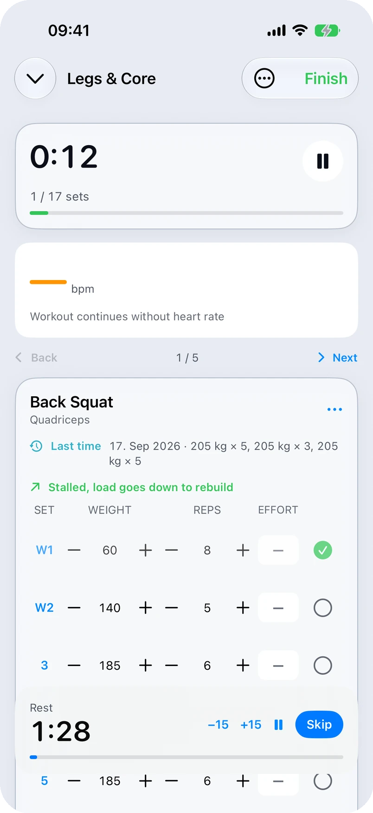
</p>

The **Training** tab is your gym notebook. Build routines (Push, Pull, Legs…), plan which days you
train and see your weekly training goals at the top.

**Starting a workout always opens the same screen**, wherever you tap it: today's plan, a freestyle
session, one of your routines, or a cardio activity like running or cycling.

During a strength workout you see each exercise with **what you lifted last time** and a hint for
today ("stalled, load goes down to rebuild"). Tick off a set and the rest timer starts on its own.
Everything works offline, even in a basement gym without signal. If the app closes, your workout is
still there when you come back.

Extras for those who want them: supersets, one-arm and one-leg exercises, how hard a set felt (RPE or
reps in reserve), warm-up sets, a plate calculator and 1,324 exercises with descriptions. The strap or
an Apple Watch adds your heart rate.

<table>
<tr>
<td width="36%" align="center">
  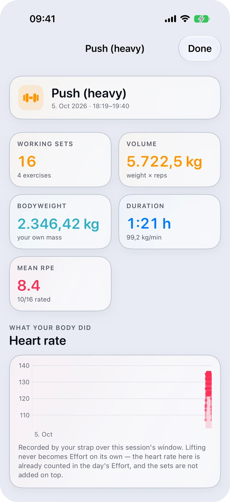
</td>
<td width="64%" valign="middle">

**After the workout** you get a summary: working sets, total weight moved, duration, how hard it felt
on average and what your heart did during the session.

Forgot to stop the workout? You can set its start and end later, directly on the heart rate curve.

</td>
</tr>
</table>

### Running, walking and cycling with GPS

<p align="center">
  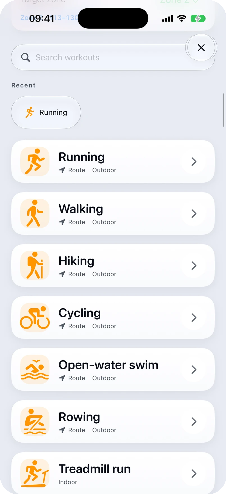
  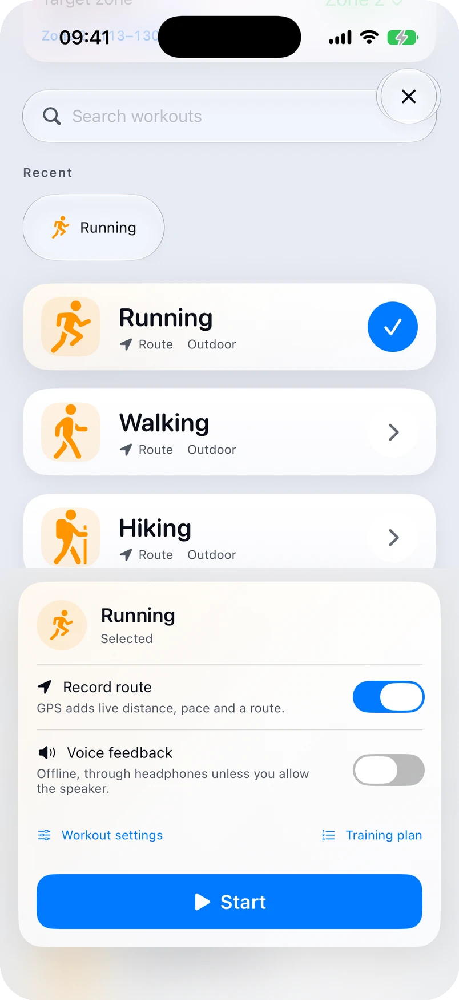
  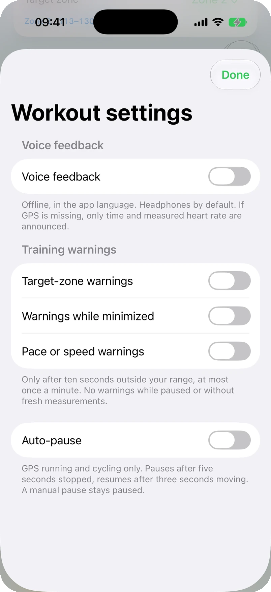
</p>

Pick an activity, decide whether to record the route and press **Start**. Outdoor activities such as
running, walking, hiking, cycling, rowing or open-water swimming can record a GPS route. Indoor ones
like a treadmill run never ask for your location. Your heart rate comes from the strap or an Apple
Watch.

**While you run** the screen shows the time in large numbers, then heart rate, Effort, distance, your
current pace (from the last 30 seconds) and your average pace. Swipe to two more pages: the **heart
rate zones** you have spent time in, and your **laps and kilometre splits**. The workout keeps running
with the phone in your pocket and shows on the Lock Screen and in the Dynamic Island, where you can also
pause and end it.

**What you can set up**

| Setting | What it does |
|---|---|
| **Voice feedback** | Spoken updates every 0.5, 1 or 2 km (or miles), or every 5, 10 or 15 minutes, with your split pace and heart rate. Works offline, in the app's language, through headphones by default. Music is turned down only while it speaks |
| **Target-zone warnings** | Pick a heart-rate zone before you start. The phone tells you when you stay outside it, and with a strap a gentle buzz says "faster" or "slower" |
| **Pace or speed warnings** | A target pace for running or a speed for cycling. Warnings come only after ten seconds outside your range and at most once a minute |
| **Auto-pause** | For GPS running and cycling. Pauses after five seconds standing still, for example at a traffic light, and continues after three seconds of moving |
| **Training plan** | Build intervals: warm-up, work, recovery and cool-down, each by time or distance. Save them as templates and change upcoming steps during the run |
| **Pacer** | Set a goal time for a distance and see whether you are ahead or behind |
| **Speaker** | Off by default, so nothing is read out loud on the bus by accident |

**Honest GPS.** The app only counts distance when the phone is sure you are really moving. Weak or
jumpy GPS points are thrown away, and a gap in the signal is shown as a gap instead of a straight line
across the map. With poor reception it may record a little too little, never too much.

**Afterwards** you get a summary with your route, splits and zones. If you ran your fastest kilometre
so far (compared with your own earlier runs in the app), it tells you. The workout can go to Apple
Health with its route, and you can export it as a GPX or FIT file for other apps.

### Which muscles did the work?

<p align="center">
  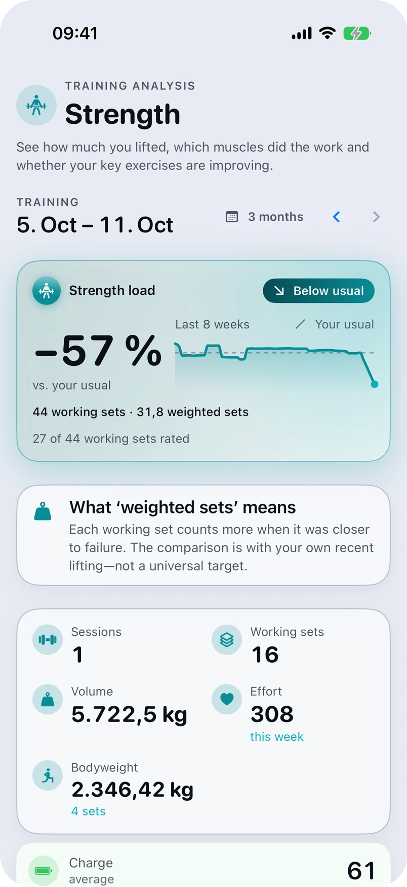
  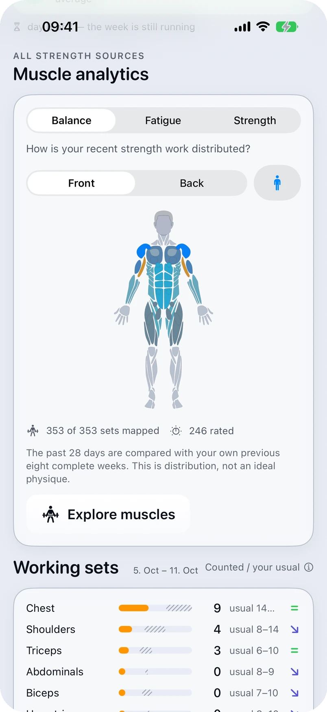
  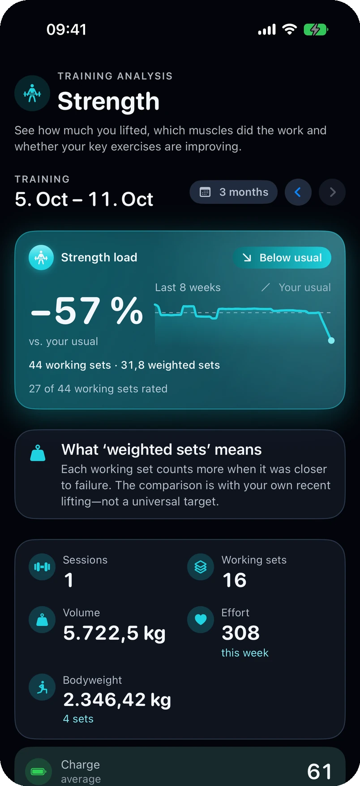
</p>

The **Strength** page answers three plain questions on one body map:

- **Balance:** which muscles got how much work over the last four weeks, compared with what is normal
  *for you*. No ideal physique, no universal rules.
- **Fatigue:** which muscles probably still carry training stress from recent sessions.
- **Strength:** for which muscles your lifts are going up, staying level or going down.

A set that was close to failure counts more than an easy one. If the app cannot tell which muscle an
exercise trains, it says so instead of guessing. Details: [muscle analytics](docs/fork/MUSCLE_ANALYTICS.md).

### Training Load: are you doing too much or too little?

<p align="center">
  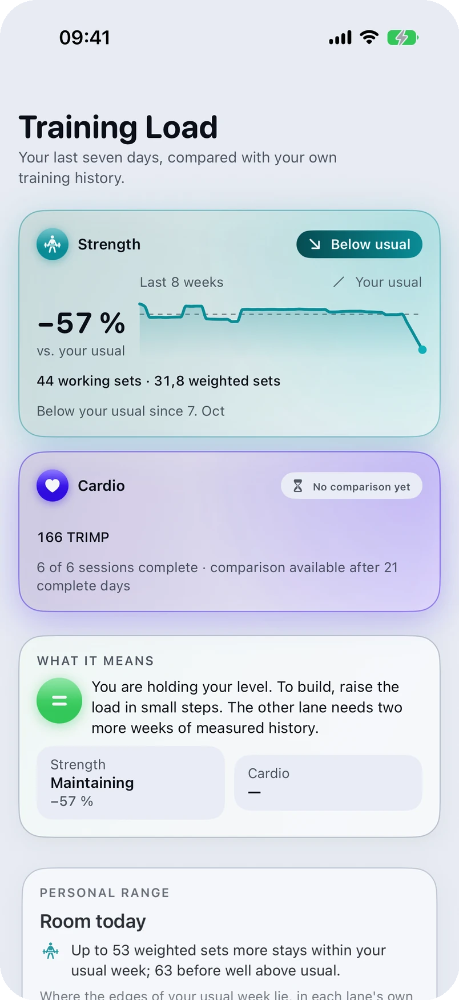
  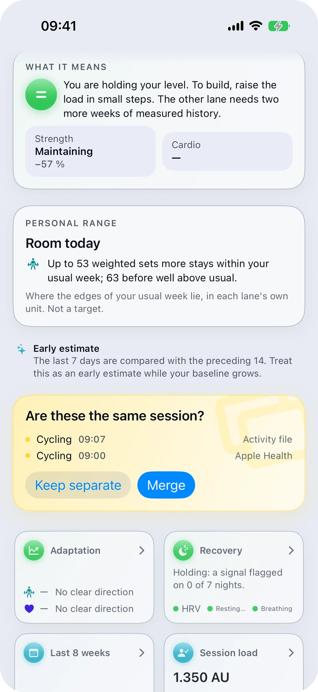
  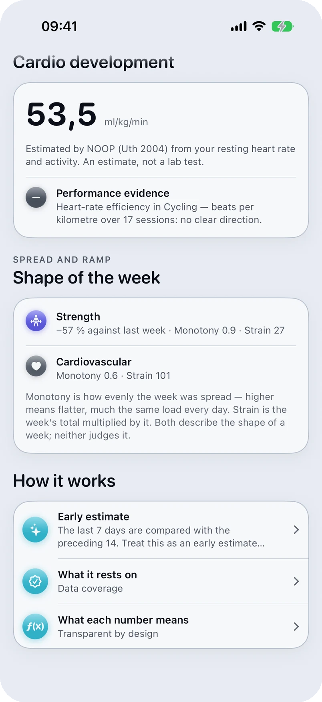
</p>

Training Load compares your **last seven days with your own history** and tells you in one sentence
what it means: building up, holding your level or backing off. Strength and cardio are kept apart,
because a heavy leg day and a long bike ride stress your body in different ways.

- **Room today** tells you how much more you can do this week and still stay within your normal range.
- **Duplicate check:** if your strap and your watch both recorded the same ride, the app asks you
  whether to merge them instead of counting the ride twice.
- **Cardio fitness:** an estimated VO₂max (how much oxygen your body can use) and whether it is
  improving.

<table>
<tr>
<td width="36%" align="center">
  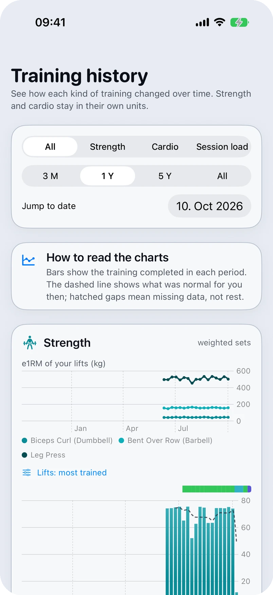
</td>
<td width="64%" valign="middle">

**Training history** goes back as far as your data does: three months, a year, five years or
everything. Jump to any date to see what you were doing back then, and follow your estimated maximum
lift for each exercise over time.

</td>
</tr>
</table>

### Cardio analysis: how your endurance training is going

<p align="center">
  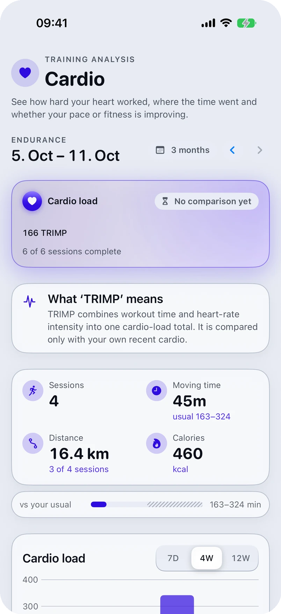
  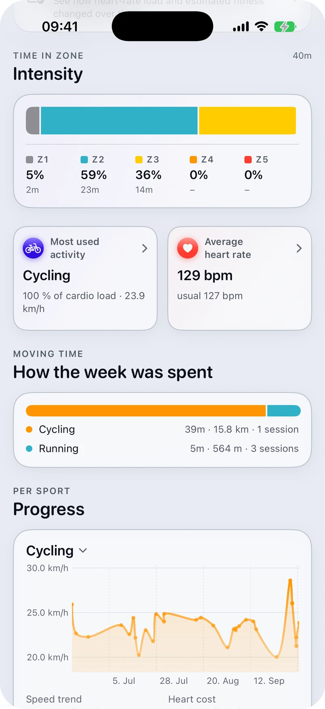
  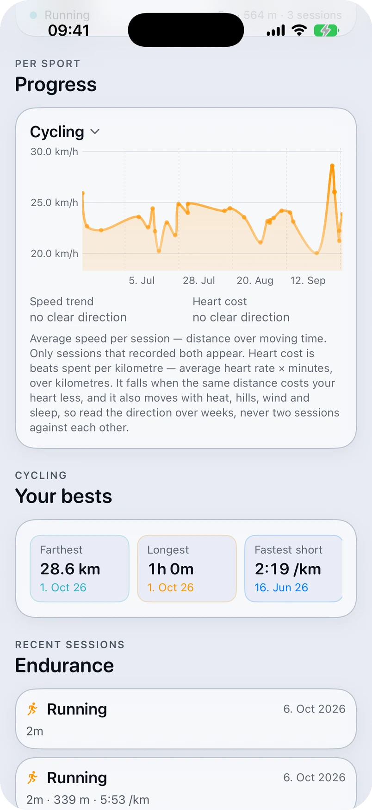
</p>

The **Cardio** page looks at everything that gets your heart working: running, cycling, walking,
rowing, swimming, classes and more.

- **Cardio load for the week.** One number that combines how long you trained and how high your heart
  rate was (called TRIMP). Thirty easy minutes and ten hard minutes can count about the same. It is
  compared with your own usual week, so you see at once whether you did more or less than normal.
- **The week in figures:** sessions, moving time, distance and calories, each with your usual range.
- **Intensity:** how many minutes you spent in each of the five heart-rate zones, from very easy (zone
  1) to all-out (zone 5). Useful if you want most of your training to be easy, as many endurance plans
  recommend.
- **How the week was spent:** which sports took how much of your time.
- **Progress per sport:** your average speed over the weeks and the "heart cost", meaning how many
  heartbeats one kilometre takes. When the same distance costs fewer beats, your fitness is improving.
  Heat, hills and poor sleep move it too, so the app tells you to watch the direction over weeks, not
  single sessions.
- **Your bests:** farthest, longest and fastest session per sport, with the date.
- **Recent sessions** with their heart rate, one tap away from the full detail.

<table>
<tr>
<td width="36%" align="center">
  
</td>
<td width="64%" valign="middle">

**Cardio fitness over time.** The app estimates your **VO₂max**, the amount of oxygen your body can use
at full effort and the classic measure of endurance fitness. It is worked out from your resting heart
rate and activity using a published method, so it is an estimate, not a lab test, and the screen says
so. Next to it, "performance evidence" checks whether your heart rate for the same pace is going down,
which is the most direct sign that you are getting fitter.

**Workouts** lists every session from every source, with a colour badge showing where it came from
(strap, Apple Watch, Hevy or entered by hand).

</td>
</tr>
</table>

<p align="center">
  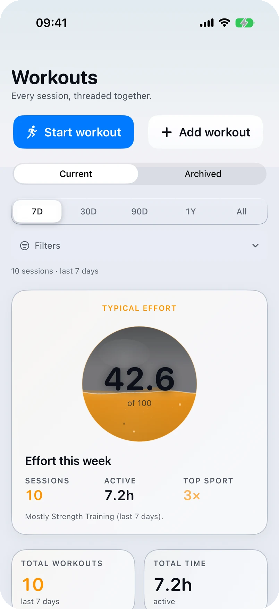
</p>

### Goals that bend with real life

<p align="center">
  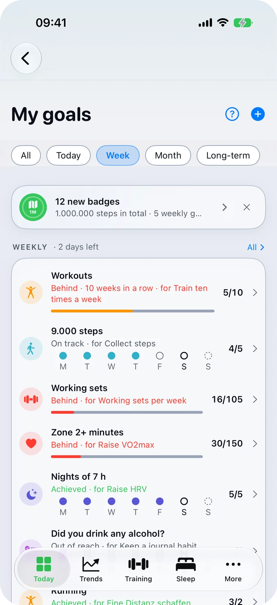
  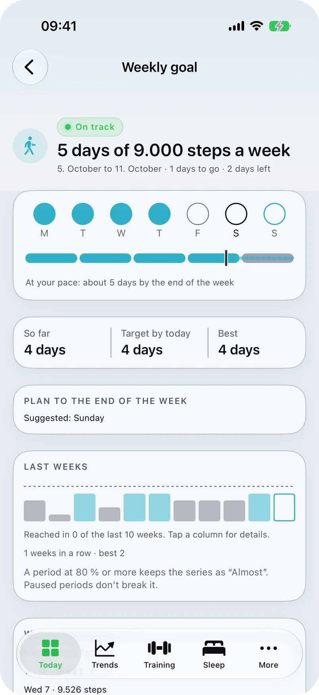
  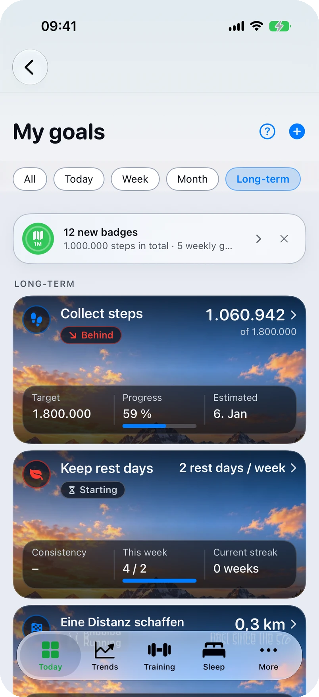
  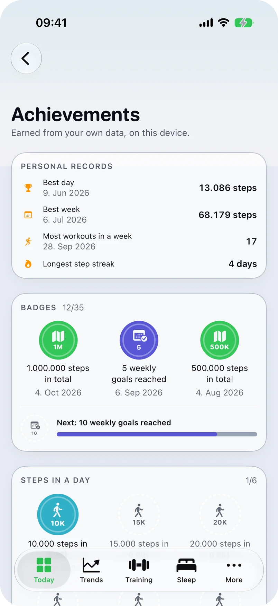
</p>

Set goals on four levels:

| Level | Examples |
|---|---|
| **Daily** | 10,000 steps, 7 hours of sleep, a workout, or a box to tick like "meditated" |
| **Weekly** | 4 workouts, 150 minutes in zone 2, 5 nights of 7 hours, 100 working sets |
| **Monthly** | 100 km of running, 20 workouts, 25 days with enough steps |
| **Long-term** | Reach a target weight by summer, collect 1.8 million steps, keep two rest days a week |

What makes them different:

- **A fair pace.** Your weekly target is spread over the days you actually plan to train, with your
  rest days left out. A marker shows where you should be by today, so on Wednesday "2 of 5" can be
  perfectly on track.
- **Clear states in words, not just colours:** Reached, Ahead, On track, Close, Behind, Out of reach,
  Protected.
- **Life happens.** A week where you reached 80% counts as "almost" and does not break your streak.
  Pause a goal or get ill, and your streak is protected.
- **Most goals tick themselves.** Steps, sleep and workouts are measured automatically. For things the
  app cannot see, it asks you the next day: "Done yesterday?"
- **Suggestions from your own weeks.** When you set up a goal, the app offers an easy, a recommended
  and an ambitious level, based on what you actually did recently.
- **Records and badges** are real facts from your data, like your best week, never random rewards.

Goals also appear on the Home Screen as a widget, on the Lock Screen, on the Apple Watch and through
Siri ("How am I doing on my goals?").

### Your body, your energy, your fitness age

<p align="center">
  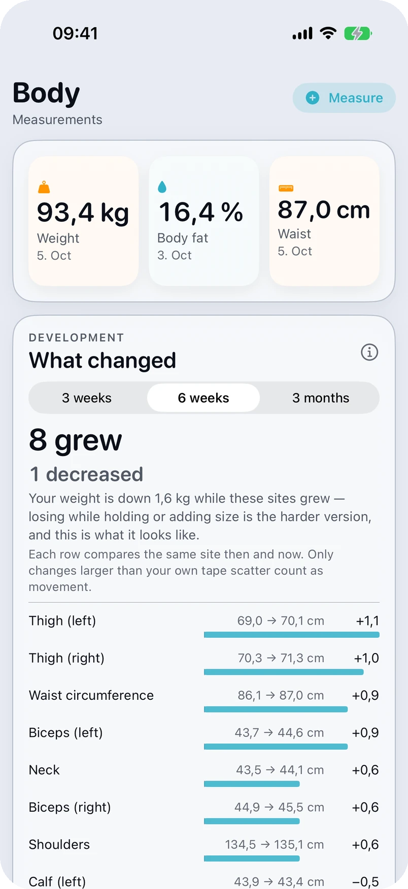
  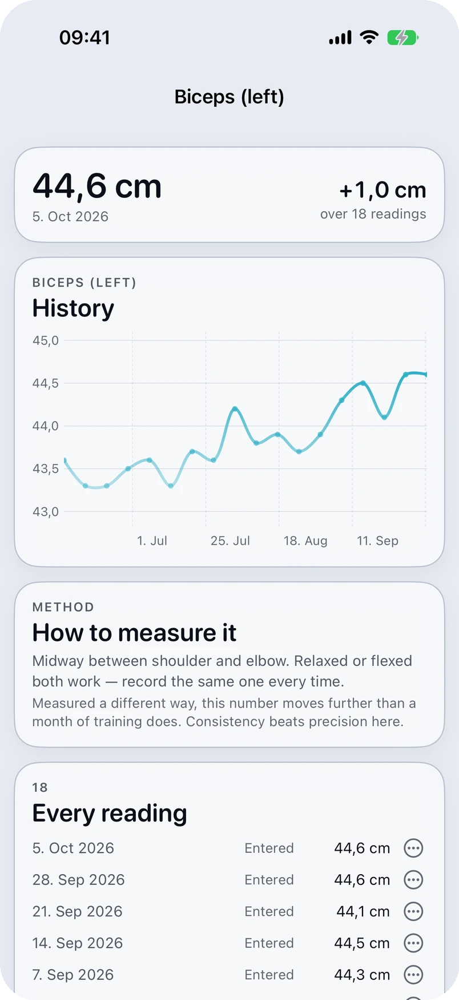
  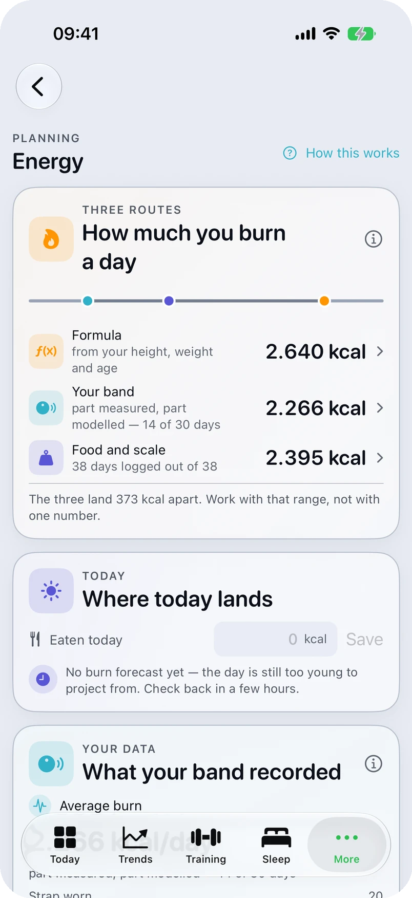
</p>

**Body** keeps your weight, body fat and tape measurements in one place. "What changed" shows which
measurements went up or down over three weeks, six weeks or three months. Each body part has its own
history and a short guide on how to measure it the same way every time. Progress photos stay on your
phone.

**Energy** answers "how much do I burn in a day?" in three independent ways: a formula based on your
height, weight and age, what your strap measured, and what your food log and scale imply. They never
agree perfectly, and the app shows you the gap instead of hiding it. That gap tells you how much to
trust any single number.

<table>
<tr>
<td width="50%" align="center">
  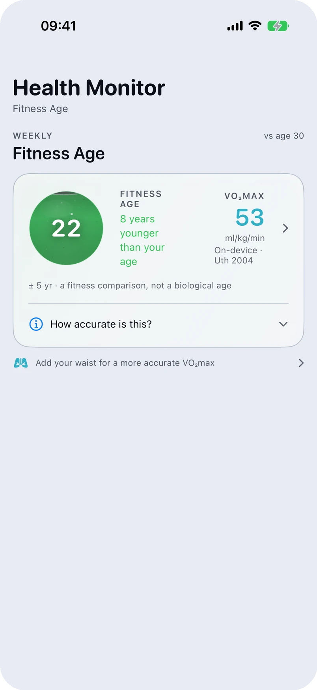
</td>
<td width="50%" align="center">
  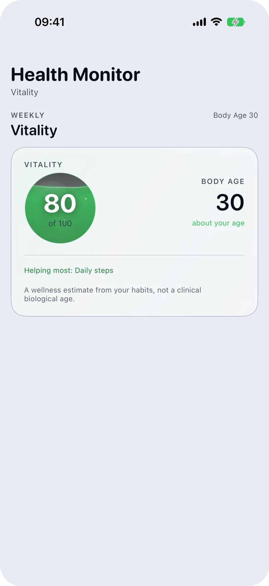
</td>
</tr>
</table>

**Fitness Age** compares your cardio fitness with typical people of different ages, based on a
well-known study from Norway. "8 years younger than your age" means you are fitter than the average
person your age. **Vitality** turns your habits (steps, sleep, training) into a score from 0 to 100.
Both are estimates for motivation, not medical measurements, and the app says so right next to the
number.

### Find out what affects you

<p align="center">
  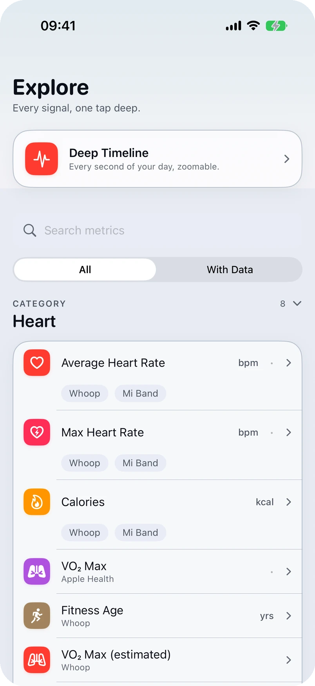
  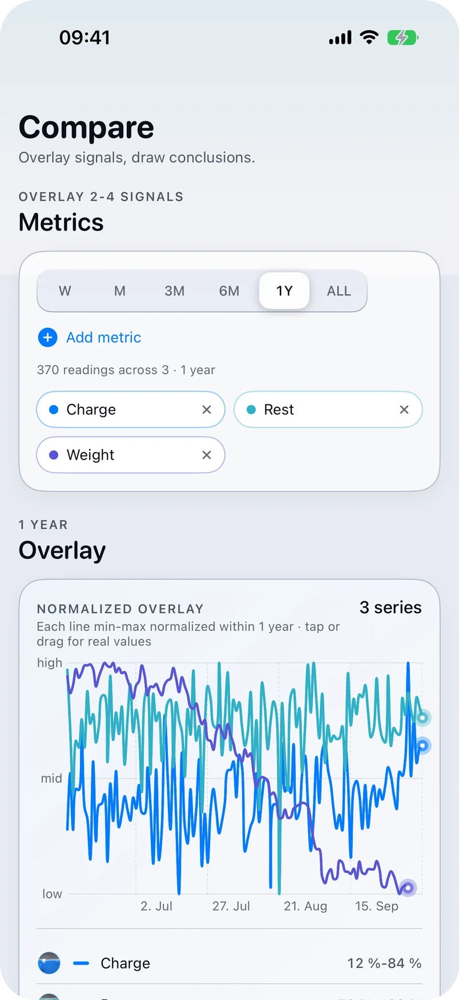
  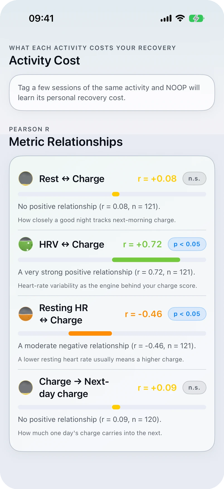
  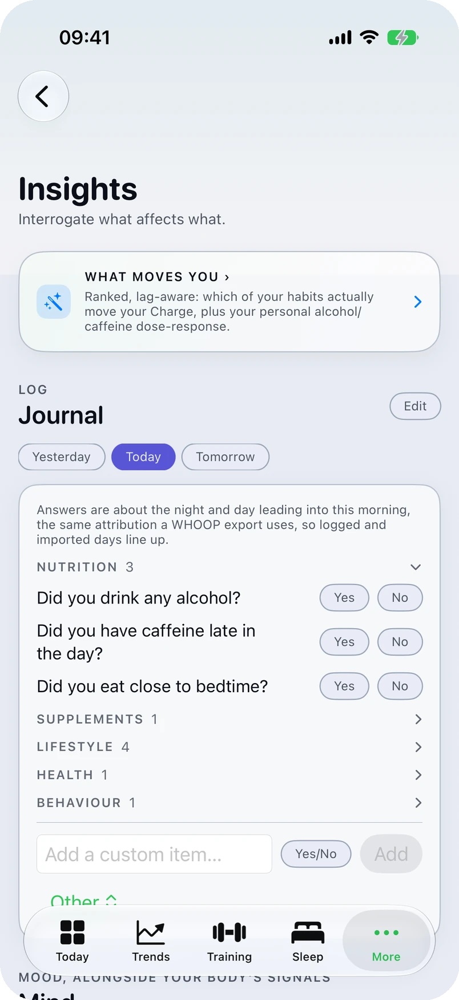
</p>

- **Explore** lists every single thing the app measures, from heart rate to VO₂max. Tap one to see its
  history.
- **Compare** puts up to four values on one chart. Does your Charge drop when your weight goes up?
  You will see it.
- **Insights** checks which of your habits really move your scores, using only your own data. "Late
  caffeine shows up in your HRV the next morning", or "no clear effect yet".
- **Journal** asks a few quick yes or no questions each day (alcohol, late caffeine, eating close to
  bedtime, meditation…). The more days you log, the more Insights can tell you.

### Breathe and intervals

<table>
<tr>
<td width="50%" align="center">
  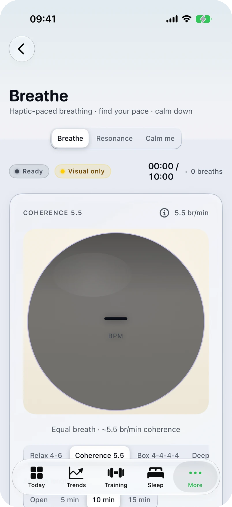
</td>
<td width="50%" align="center">
  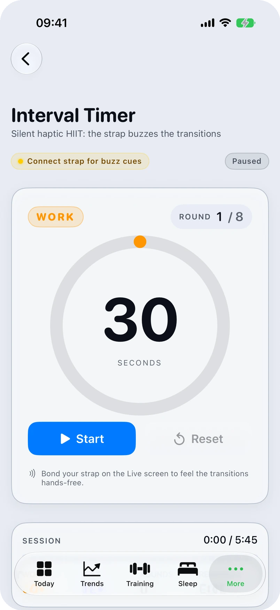
</td>
</tr>
</table>

**Breathe** guides slow breathing with a gentle buzz on your wrist: one pulse to breathe in, two to
breathe out. You can close your eyes. At the same time the strap measures how your HRV responds. Many
patterns are included, from calm 4-6 breathing to box breathing.

**Intervals** is a silent workout timer. The strap buzzes at every change between work and rest, so
you never have to look at a screen.

### ECG on the WHOOP MG

The WHOOP MG has electrodes for an ECG. NOOP Forge can take a **30-second reading**: hold your finger
on the strap and watch the trace appear. Afterwards it shows your heart rate, how regular the rhythm
was and the standard intervals of the heartbeat, drawn at the same scale as a paper ECG. You can put a
reading next to an Apple Watch ECG to compare. Readings are saved on your phone.

This is **not a medical device** and gives no diagnosis. If you are worried about your heart, see a
doctor.

### An AI coach that knows your data (optional)

<p align="center">
  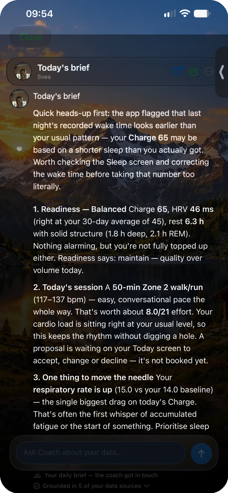
  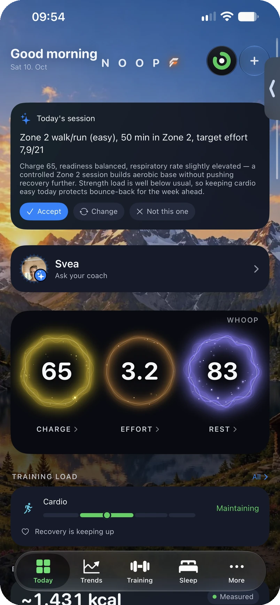
  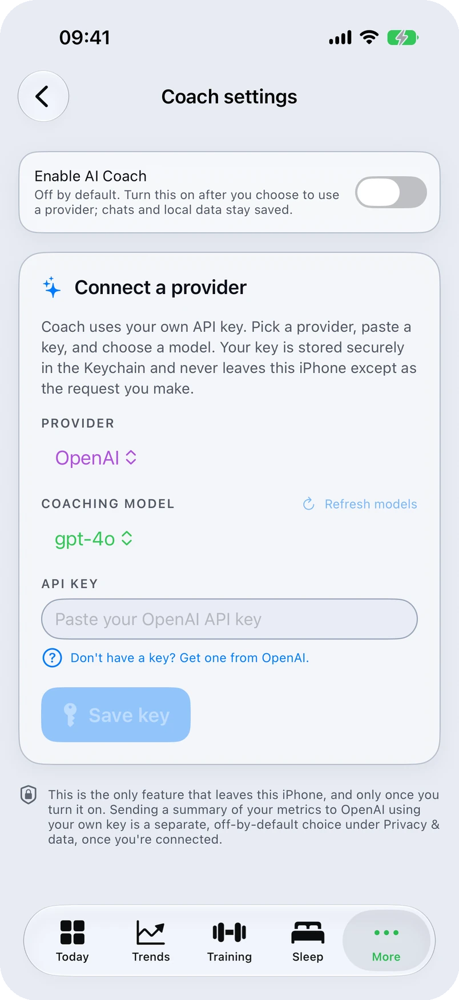
</p>

Ask questions about your own body in normal language. "Why is my Charge low today?" "Did I really train
in zone 2 this week?" "Is coffee hurting my sleep?" The coach looks up your real numbers and answers
from them.

**Every morning a short brief** sums up your night and your readiness, suggests one session for the
day and names the one thing that would help most. If something looks off, for example a wake time
that seems too early, it says so first instead of planning your day on a wrong number. The suggested
session appears on Today with **Accept**, **Change** and **Not this one**. The effort it is worth is
calculated by the app from your own heart rate zones, not invented by the AI.

- **Off until you turn it on.** It is the only part of the app that uses the internet.
- **You choose the AI.** Use your own key for Anthropic, OpenAI, Google Gemini or OpenRouter, or run a
  model on your own computer so nothing leaves your home.
- **You choose what it may read**, topic by topic: sleep, workouts, stress, your journal and so on.
- **It suggests, you decide.** It can propose a workout or a goal, but nothing is saved until you
  accept it.
- **It remembers** what you told it ("my knee hurts when I run"), and you can see, edit and delete
  every memory.
- **Make it your coach.** Give it a name and a photo, choose a calm, friendly or direct style and how
  long its answers should be.

### Devices, settings and the rest

<p align="center">
  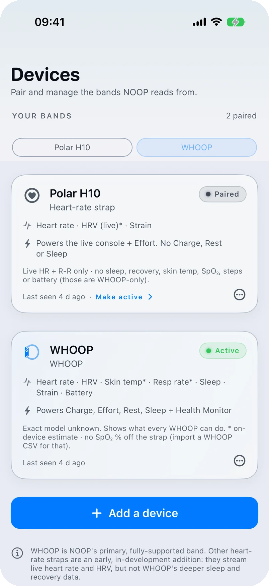
  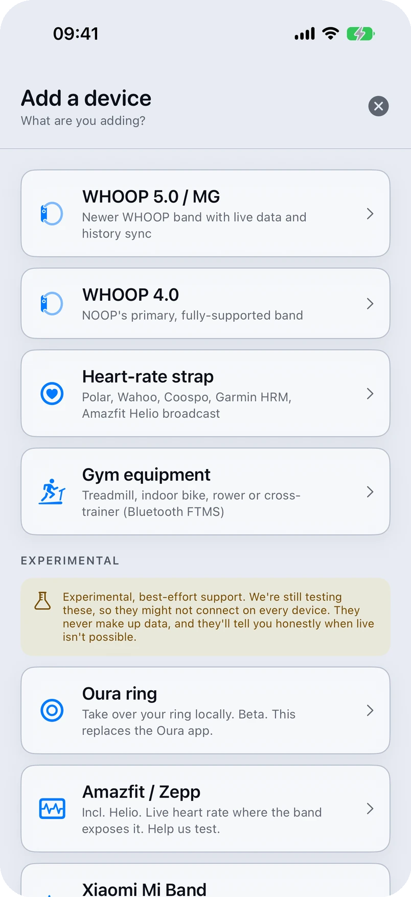
  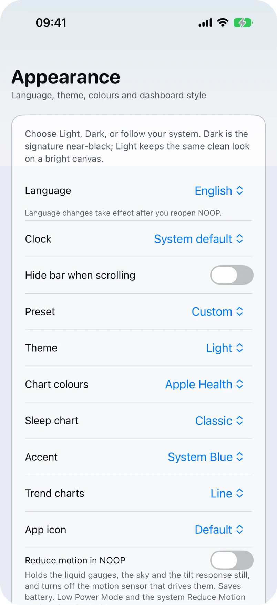
  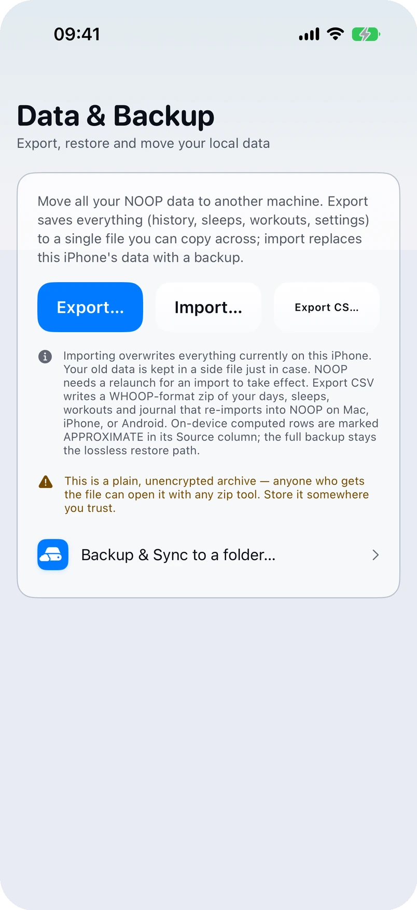
</p>

- **Devices:** besides WHOOP straps, any standard heart-rate chest strap (Polar, Wahoo, Garmin and
  others) works for live heart rate. Oura rings are supported experimentally.
- **Make it yours:** ten languages, light or dark mode, chart colours, the app icon colour and which
  optional features you want (hydration tracking, automatic workout detection, journal reminders).
- **Backups:** one file holds everything. Save it to a folder of your choice (for example iCloud Drive)
  automatically every day, and restore it on a new phone.

| Also included | What it does |
|---|---|
| **Widgets** | Your scores, heart rate, stress, energy and goals on the Home Screen and Lock Screen |
| **Apple Watch** | A companion app with complications, live heart rate, breathing and workouts |
| **Siri and Shortcuts** | "How am I doing on my goals?", sync the strap, ask the coach, export a route |
| **Live Activities** | A running workout or a strap sync on the Lock Screen and in the Dynamic Island |
| **Illness early warning** | Optional. Tells you when several body signals change at the same time, as often happens before a cold. Not a diagnosis |
| **Strap automations** | Double-tap the strap to mark a moment, a buzz when your heart rate goes too high during a workout |
| **Imports** | WHOOP export, Apple Health, Strong, Hevy, FitNotes, GPX, TCX and FIT routes |
| **Mac app** | The full app on your Mac, plus your heart rate in the menu bar |

---

## NOOP Forge or ryanbr/noop?

NOOP Forge is a **fork**: a copy of the open-source project [NOOP by ryanbr](https://github.com/ryanbr/noop)
that is developed further on its own. The connection to the strap, the scores and the basic design come
from NOOP. Forge regularly takes over NOOP's improvements and builds its own features on top.

Both are free, both keep your data on your device, and both need no WHOOP subscription.

### Which one is right for me?

| If you… | Choose |
|---|---|
| use an **Android** phone | **ryanbr/noop.** Forge is for Apple devices only |
| want the **official** project with a community (Discord, Reddit, issue tracker) | **ryanbr/noop** |
| want a **workout log, goals, body tracking and muscle analysis** in the same app | **NOOP Forge** |
| want an **AI coach** that can look up your real data and suggest plans | **NOOP Forge** |
| want to take **ECG readings** with a WHOOP MG | **NOOP Forge** |
| use **iPhone or Mac** and want the most features | **NOOP Forge** |

### Side by side

Status 10 October 2026: NOOP Forge 12.0.1, ryanbr/noop 12.1.0. Forge contains every change ryanbr/noop
has published up to that date.

| | ryanbr/noop | NOOP Forge |
|---|---|---|
| **Platforms** | Android, iPhone, iPad, Mac, Apple Watch | iPhone, iPad, Mac, Apple Watch |
| **Who makes it** | The original project and its community | One anonymous developer, building on the original |
| **Charge, Effort, Rest, sleep, HRV, stress** | ✅ | ✅ Same foundation |
| **Today screen** | Rings or liquid vessels | Three layouts, landscapes that follow the day, a Momentum feed |
| **Score explanations** | ✅ | ✅ Plus a breakdown of every Charge point |
| **Workout logging** | A gym log book: sets, programs, double-tap the strap for the next set | The same, plus a full training hub: routines, weekly plan, 1,324 exercises, supersets, rest timer, plate calculator, progression hints |
| **Starting a workout** | Separate places | One start screen everywhere, Apple-style live view with spoken splits |
| **Muscle analysis** | Not available | Balance, fatigue and strength on a body map |
| **Training Load** | One card | Separate strength and cardio, years of history, "room today", duplicate check |
| **Goals** | A hydration goal | Daily, weekly, monthly and long-term goals with fair pace, streaks, badges, widget, Watch and Siri |
| **Body tracking** | Weight in the profile | Weight trend, body fat, tape measurements per body part, progress photos |
| **Energy** | Calorie estimates | A dedicated page comparing three independent estimates |
| **ECG (WHOOP MG)** | Experimental capture, no reading screen | Full 30-second readings with analysis and Apple Watch comparison |
| **AI coach** | Answers questions from a short summary of your data. Anthropic, OpenAI, Gemini or your own server | Looks up 38 kinds of data itself, suggests workouts and goals, remembers what you told it, permission per topic. Adds OpenRouter |
| **Hevy** | Import | Two-way sync: reads your workouts and sends routines you approved |
| **Imports** | WHOOP, Apple Health, Health Connect, Strong, Hevy, nutrition CSV | WHOOP, Apple Health, Strong, Hevy, FitNotes, nutrition CSV, lab reports from a photo or PDF |
| **Widgets** | Main, heart rate, stress, coach | The same plus score rings, energy and goals |
| **Languages** | 10 | The same 10 |
| **Install on iPhone** | AltStore, SideStore or direct IPA | The same, with its own source |
| **Release names** | `v12.1.0` | `v12.0.1-dx`, so the two never collide |

<details>
<summary><b>The technical differences in detail</b></summary>

| | ryanbr/noop | NOOP Forge |
|---|---|---|
| Code base | Swift and Kotlin, kept byte-identical by rule | Swift only. The Android parity rule was retired on 23 July 2026 and the Android tree removed on 14 August 2026 |
| Swift packages | 8 | 11: adds `StrandTraining`, `MuscleMap` and `SemanticMemory` |
| Coach | 2 source files plus 4 provider adapters | About 60 source files, 38 tools, nine permission purposes, an on-device embedding model for memory |
| Coach memory | Stored chat messages | Up to 120 facts with confirmation for health facts, expiry and ranking; on-device semantic search |
| Calorie model | Heart-rate formula | Version 9: walks priced by pace, other sessions by a VO₂max that fits the body, opt-in Apple Watch calibration |
| Benchmarks | Sleep staging, PSG | Adds energy and memory retrieval benches |
| CI | Android, parity, packages, app build, hygiene | Packages, release builds, attribution and translation gates |

Shared by both: the Bluetooth decoders and safety checks, WHOOP 4.0 and 5.0/MG support, experimental
Oura and Polar paths, the storage layer, the core scoring, Breathe, Intervals, Stress, Mind, the lab
book, alarms, backups and the design system. Backups from ryanbr/noop can be imported into Forge.

</details>

---

## Privacy in plain words

Everything stays on your device: your strap data, scores, workouts, goals, journal and coach memories.
There is no NOOP server and no account. Nobody, including the developer, can see your data.

The app only goes online in these cases, and only if you allow it:

| What | When |
|---|---|
| **AI coach** | Only if you turn it on, only to the AI provider you picked, never raw heart data |
| **Update check** | When you tap it, or at most once a day if you allow it |
| **Hevy sync** | Only if you connect your Hevy account |
| **Oura cloud import** | Only in a build you compile yourself with your own Oura developer key. Pairing a ring over Bluetooth needs no internet |

- No ads, no tracking, no analytics, no crash reports sent anywhere.
- NOOP contains no WHOOP software. It talks to the strap you own, the same way a heart-rate app talks to
  a chest strap.
- Your backup is a single file that you control.

More detail: [Privacy and security](docs/PRIVACY_SECURITY.md) and [Scope](docs/SCOPE.md).

---

## Install

NOOP Forge is not in the App Store. That is deliberate: it keeps the project independent and anonymous.
Instead you install it with a free helper app that signs it with your own Apple ID.

<table>
<tr>
<td width="50%" valign="top">

### 📱 iPhone and iPad

1. Install **[AltStore](https://altstore.io)** or **[SideStore](https://sidestore.io)** (follow their
   guide, it takes a few minutes).
2. Add this source:
   ```
   https://raw.githubusercontent.com/DX23876/noop/main/altstore-source.json
   ```
   - **AltStore:** Browse → **+** → paste the link.
   - **SideStore:** Sources → **+ Add Source** → paste the link.
3. Install **NOOP Forge** from that source and open it.

With a free Apple ID the app has to be refreshed every seven days. AltStore and SideStore do that for
you in the background.

You can also download the file directly from the
[release page](https://github.com/DX23876/noop/releases/tag/v12.0.1-dx):
`NOOP-ios-unsigned-v12.0.1-dx.ipa` includes the widgets, and
`NOOP-ios-full-unsigned-v12.0.1-dx.ipa` also contains the Apple Watch app. More in the
[iOS guide](docs/IOS.md).

</td>
<td width="50%" valign="top">

### 💻 Mac

1. Download `NOOP-macos-v12.0.1-dx.zip` from the
   [release page](https://github.com/DX23876/noop/releases/tag/v12.0.1-dx).
2. Unzip it and move **NOOP** to your Applications folder.
3. The first time, **right-click → Open** (a normal double-click is blocked because the app is not
   from the App Store).
4. Allow Bluetooth when asked.

Works on Apple Silicon and Intel Macs.

### 🛠️ Build it yourself

For developers: you need Xcode 26 or later and
[XcodeGen](https://github.com/yonaskolb/XcodeGen).

```bash
git clone https://github.com/DX23876/noop.git
cd noop && xcodegen generate
open Strand.xcodeproj
```

Choose **NOOPiOS** for iPhone or **Strand** for Mac. See the [build guide](docs/BUILD.md).

</td>
</tr>
</table>

**Updating keeps your data.** **Moving to a new phone:** export a backup under Data & Backup and import it
on the new device.

---

## For the technically curious

Want to know exactly how a number is calculated or how the app talks to the strap? It is all written
down:

| Topic | Read |
|---|---|
| How Charge, Effort, Rest, sleep and HRV are calculated, with sources | [Analytics](docs/ANALYTICS.md) · [FAQ](docs/FAQ.md) |
| Every feature in detail | [Feature guide](docs/FEATURES.md) |
| The AI coach: all 38 tools, permissions, memory, safety rules | [Coach guide](docs/fork/COACH.md) |
| Balance, fatigue and strength on the muscle map | [Muscle analytics](docs/fork/MUSCLE_ANALYTICS.md) |
| Fitness Age and the study behind it | [Fitness Age](docs/FITNESS_AGE.md) |
| How the app talks to the strap | [Protocol](docs/PROTOCOL.md) · [Device roadmap](docs/DEVICE_SUPPORT_ROADMAP.md) |
| How the code is organised | [Architecture](docs/ARCHITECTURE.md) · [Data model](docs/DATA_MODEL.md) · [Packages](docs/LIBRARY.md) |
| Privacy and security | [Privacy and security](docs/PRIVACY_SECURITY.md) |
| Building, signing, contributing | [Build](docs/BUILD.md) · [Fork guide](docs/FORK_GUIDE.md) · [Contributing](docs/CONTRIBUTING.md) |
| Everything else | [Documentation map](docs/README.md) |

<details>
<summary><b>How the code is built</b></summary>

All logic lives in Swift packages that run without the app, without a strap and without Bluetooth, so
they can be tested on their own. The apps for iPhone, Mac and Watch are thin layers on top.

```
 Apps        iPhone · Mac · widgets · Apple Watch
 Coach       chat, AI providers, tools, goals, permissions
 ─────────────────────────────────────────────────────────────
 Design      StrandDesign          colours, components, charts
 Training    StrandTraining        routines, exercises, set maths
             MuscleMap             muscles and body maps
 Memory      SemanticMemory        on-device search for the coach
 Import      StrandImport          WHOOP, Apple Health, Strong, Hevy
 Analytics   StrandAnalytics       HRV, recovery, strain, sleep, load
 Storage     WhoopStore            SQLite database and migrations
 Protocol    WhoopProtocol         reading the strap's Bluetooth data
             OuraProtocol · PolarProtocol
```

- The app never sends commands that could change or erase anything on the strap, and checks every
  message from it for transmission errors.
- When a scoring formula changes, old days are recalculated in a controlled step, never silently.
- A new way of reading a body signal is only trusted after it follows real changes across many nights.
  Until then it stays an experiment you have to switch on.

</details>

---

## About the project

NOOP Forge is an independent, non-commercial fork of [ryanbr/noop](https://github.com/ryanbr/noop) and
not the official NOOP app. It was called NOOP AI until October 2026. The original project deserves the
credit for the strap connection, the scores and the design. NOOP Forge is not affiliated with WHOOP.

The Bluetooth work builds on community research, with thanks to
[`johnmiddleton12/my-whoop`](https://github.com/johnmiddleton12/my-whoop) (WHOOP 4.0),
[`b-nnett/goose`](https://github.com/b-nnett/goose) (WHOOP 5.0/MG) and
[`groue/GRDB.swift`](https://github.com/groue/GRDB.swift) (database).

> [!IMPORTANT]
> NOOP Forge is not a medical device. Its scores, ECG readings and health values are estimates for
> personal use, not medical advice or a diagnosis. If you have health concerns, talk to a doctor.

## License

Source-available under the [PolyForm Noncommercial License 1.0.0](LICENSE): free for personal,
non-commercial use. See [NOTICE](NOTICE) and [ATTRIBUTION.md](ATTRIBUTION.md) for credits.
