<p align="center">
  
</p>

<h1 align="center">NOOP Forge</h1>

<h3 align="center">Your strap. Your numbers. Your coach.<br>Nothing leaves your phone unless you say so.</h3>

<p align="center">NOOP Forge turns a WHOOP strap into a complete recovery, sleep and training app that runs entirely on your iPhone and Mac. No subscription. No account. No cloud. And a coach that actually knows you.</p>

<p align="center">
  
  
  
  
  <a href="LICENSE"></a>
</p>

<p align="center">
  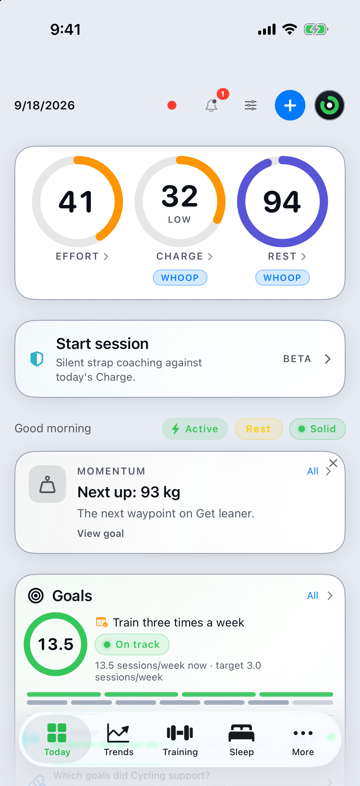
  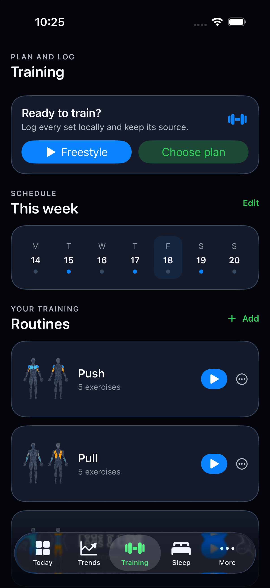
  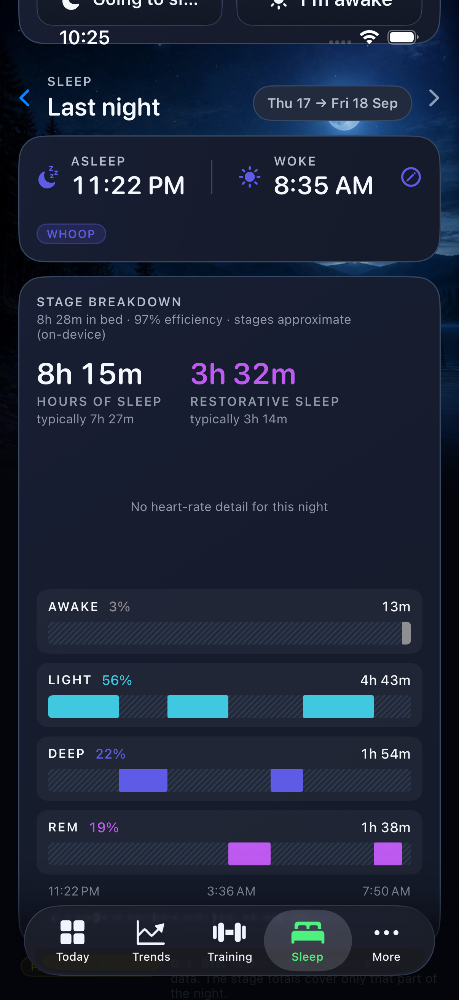
</p>
<p align="center">
  <sub>Today, Training and Sleep, all computed on the device you're holding</sub>
</p>

---

## Contents

- [Why NOOP Forge](#why-noop-forge)
- [At a glance](#at-a-glance)
- [How this fork differs from NOOP](#how-this-fork-differs-from-noop)
- [Feature tour](#feature-tour)
- [How the numbers are made](#how-the-numbers-are-made)
- [Supported hardware](#supported-hardware)
- [Where your data comes from](#where-your-data-comes-from)
- [The coach in detail](#the-coach-in-detail)
- [Privacy, precisely](#privacy-precisely)
- [Install](#install)
- [Under the hood](#under-the-hood)
- [Quality and verification](#quality-and-verification)
- [Documentation](#documentation)
- [About the project](#about-the-project)

## Why NOOP Forge

**Your strap already measures everything. You shouldn't have to rent your own data back.**

NOOP Forge reads the strap directly over Bluetooth and does the rest on your device: Charge, Effort,
Rest, sleep stages, HRV, stress, energy and training load. Everything lands in one database that you
own, back up and move with a single file.

<table>
<tr>
<td width="33%" valign="top">

#### Yours, completely

No WHOOP account, no NOOP account, no subscription, no servers to trust. Delete the app and the data
goes with it. Export it any time.

</td>
<td width="33%" valign="top">

#### A coach that knows you

Ask anything about your own sleep, recovery and training. The coach remembers what you told it, reads
your real numbers with your permission, and suggests changes you accept or ignore.

</td>
<td width="33%" valign="top">

#### Training built in

A full strength and cardio log, 1,324 exercises that work offline, muscle maps, and a Training Load
that keeps cardio and strength honest on their own scales.

</td>
</tr>
<tr>
<td width="33%" valign="top">

#### Honest numbers

Every score says how it was made and where it came from. No invented percentages, no streaks that
punish a sick day, no "×1.4 usual" before there is enough history.

</td>
<td width="33%" valign="top">

#### Goals that adapt to life

Daily, weekly, monthly and long-term goals measured against a pace that skips your rest days and
pauses when you are ill.

</td>
<td width="33%" valign="top">

#### Everywhere you look

Widgets, Lock Screen, Dynamic Island, Apple Watch, Siri and Shortcuts, in ten languages.

</td>
</tr>
</table>

### Who it is for

- **WHOOP owners who want out of the subscription** and still want their Charge, Effort and Rest.
- **Lifters and runners** who want one place for sets, cardio, load and recovery instead of three apps.
- **People who care where their health data lives**, and want to verify it by reading the source.
- **Tinkerers** who want a coach they can point at their own model, local or hosted.

### What you get on day one

1. Pair the strap. Your history syncs and your first scores appear.
2. Bring your past with you: a WHOOP export, Apple Health, Strong, Hevy or FitNotes.
3. Pick a Today layout that suits you and set your first goal in a minute.
4. Optionally switch on the coach with your own key, or point it at a model on your Mac.

It ships the way it is built: an unsigned iOS build you sideload with your own Apple ID, and a Mac app
you download or build yourself. No App Store account, no review queue, no telemetry.

## At a glance

| | |
|---|---|
| **Scores** | Charge (recovery), Effort (strain) and Rest (sleep), plus HRV, resting heart rate, respiratory rate, skin temperature, SpO₂ and stress |
| **Training** | Native strength logger, routines, 1,324 offline exercises, cardio recording, Training Load, muscle maps |
| **Energy** | Daily expenditure from NEAT, workouts and a personal forecast, with the source of every number named |
| **Goals** | Daily, weekly, monthly and long-term goals, read against a pace and never against an invented percentage |
| **Coach** | Optional. Bring your own provider or run locally; 30 consent-gated tools; on-device memory |
| **Surfaces** | iPhone and iPad app, Mac app and menu-bar item, Home and Lock Screen widgets, Live Activities, Apple Watch companion with complications, Siri and Shortcuts |
| **Languages** | English, German, French, Spanish, Italian, Portuguese (Portugal), Polish, Russian, Simplified and Traditional Chinese |
| **Storage** | One SQLite database on the device, one `.noopbak` file to move it |

## How this fork differs from NOOP

NOOP Forge is a fork of [ryanbr/noop](https://github.com/ryanbr/noop). Everything below the
Bluetooth layer started as upstream's work, and the fork keeps merging its fixes. This section lists
what is different, area by area, so you can judge which one fits you. Statements about upstream come
from its code and release notes at `071e4046e` (4 October 2026); upstream keeps moving, so its own
README is the authority on what it ships today.

### The two projects in numbers

| | ryanbr/noop | NOOP Forge |
|---|---|---|
| Version line | 11.8.0 plus 356 commits on `main` | 11.8.5, branched from the same 11.8 line |
| Commits the other side lacks | 52 not yet merged into the fork | 546 not in upstream |
| Files outside docs, tools and Android | 23 that the fork lacks | 814 that upstream lacks |
| Swift packages | 8 (Protocol, Oura, Polar, Store, Analytics, Import, Design, local access) | 11: adds `StrandTraining`, `MuscleMap` and `SemanticMemory` |
| Screens in the macOS and shared app | 104 | 187 |
| Coach source files | 2 plus 4 provider adapters | 59 plus 12 provider files, and 7 goal screens |
| Languages | 10 (English plus 9) | the same 10 |

### Platforms and distribution

| | ryanbr/noop | NOOP Forge |
|---|---|---|
| Android | Full app, sideloaded APK, Health Connect, experimental one-way push to your own endpoint | Not shipped. The Android tree was deleted on 14 August 2026 |
| iPhone and iPad | AltStore/SideStore source, direct IPA | The same, with a separate source of its own |
| Apple Watch | Companion app and complications | The same, shipped only in the separate Full IPA because sideloaders install an embedded Watch bundle unreliably |
| Mac | `NOOP.app` for Apple Silicon and Intel | Universal zip, ad-hoc signed, built and tested on every release |
| Release naming | `vX.Y.Z` | `vX.Y.Z-dx`, so the fork's tags never collide with upstream's |
| Updates | In-app check once a day, can be turned off | Manual or at most daily, and update notes shown in the app |
| Community | Discord, subreddit, public issue tracker | None. An anonymous personal fork |

### The coach

| | ryanbr/noop | NOOP Forge |
|---|---|---|
| Providers | OpenAI, Anthropic, Gemini, custom OpenAI-compatible endpoint | The same plus OpenRouter, with prompt caching for Anthropic |
| Master switch | One switch retires the tab, brief, widget and every outgoing request | The same, merged from upstream |
| What it can read | A short text summary of recent metrics plus your question | 30 tools it calls itself: biometrics, sleep, workouts, stress, energy, logs, goals, long-range trends, what-if simulations |
| Consent | The key and the master switch | Each tool is consent-gated separately, and reading, proposing and applying are three different steps |
| Acting | Answers | Proposes a session, a routine, a Hevy workout or a goal setup; nothing changes until you accept |
| Memory | Stored conversation messages | On-device semantic memory with Nomic embeddings, ranked recall, reviewable and deletable, plus a background upkeep pass by a cheaper model |
| Local models | Custom endpoint such as Ollama | The same, and tool-less providers get an on-device context planner that picks which data to include |
| Personality | One voice | Name, avatar, voice presets (Svea, Marv), Guardian, Friend or Commander style, answer length |
| Proactive | Morning brief | Brief, plan reminders, goal nudges, check-ins and a plan consequence view, all behind their own switches |
| Charts | Not in chat | Charts and cards the coach can draw into a conversation |

### Training and strength

| | ryanbr/noop | NOOP Forge |
|---|---|---|
| Lift log | On-device gym log book, programs, set metrics, advancing the set with a strap double-tap, a Live Activity | The same log, which the fork inherited and kept |
| Native training | None | A separate Training hub: routines, weekly schedules, freestyle and past sessions, supersets, unilateral work, RPE and RIR, rest timers, plate loading, warm-up planning, progression and resumable drafts |
| Exercise catalogue | Exercise picker | 1,324 exercises offline with anatomy aliases and optional demonstration media |
| Muscle analytics | Muscle groups for import | Balance, Fatigue and Strength on one muscle map with primary and secondary credit and honest coverage of unknown work |
| Live strength | Live Activity | Watch companion that runs a real HealthKit workout, keeps the set log on the phone, and survives lock, background and relaunch |
| Training Load | One load card | Lane engine: cardio priced by heart-rate reserve and strength by working sets, each in its own unit, months and years of history, outlook and notifications |
| Cardio | Workout detail, auto-detect | A cardio hub with load, background recording, Lock Screen and Dynamic Island, route handling and one session shared by Live, Workouts and Quick Actions |
| Hevy | Import of workouts and the Hevy API parsers | A sync client with credentials in the Keychain, reviewed write-back of routines and workouts, and duplicate matching |
| Other imports | Strong, Hevy CSV | Adds FitNotes and a training-plan PDF page |
| Session rating | Not present | Session RPE card and a rating policy |

### Energy, body and nutrition

| | ryanbr/noop | NOOP Forge |
|---|---|---|
| Energy | Activity cost and adaptive expenditure engines | A source-aware Energy page: NEAT, workouts and a forecast curve, with WHOOP, Apple Health and the estimate named separately, the gap shown when they disagree, and a daily burn-rate card |
| Calorie model | Heart-rate formula (Keytel) in the adaptive expenditure engine | Version 9: walks priced by pace, other sessions by a VO₂max that fits the body, no Keytel figure left, stored old figures corrected once |
| Calibration | None | An opt-in Apple Watch calibration, workout heart-rate fill from Apple Health, and an energy validation harness in `Tools/EnergyBench` |
| Energy plan | None | Targets, planning sheets and an onboarding flow |
| Weight | Profile weight | A weight page with history and trend tiers, write-back guards for Apple Health, and a body-measurement reminder |
| Body | None | Body page with measurements, circumference progress, Navy body-fat estimate, progress photos and per-site detail |
| Lab values | Lab book with CSV import | Adds text extraction from a PDF or a photo of a report, with a review screen |
| Nutrition | Nutrition CSV | Adds nutrition from Apple Health as a source |

### Goals

| | ryanbr/noop | NOOP Forge |
|---|---|---|
| Goals | A hydration goal, no goal system | Four levels: daily, weekly, monthly and long-term |
| Pace | None | Target spread over the planned days with rest days left out, nine states shown as word plus symbol, pro-rating for goals set mid-week |
| Setup | None | First goal step by step with three levels read from your own weeks, later one-tap suggestions and start packs, feasibility and safety gates |
| Journey | None | Journey page with a measured percentage only where a real baseline exists, and milestones that are facts |
| Series | None | Counts achieved and "almost" periods, protected by pauses and illness, no flames or trophies |
| Surfaces | None | Today section, goals widget, watch complication, Siri, hints in Momentum, the digest and the inbox, and goals in the `.noopbak` backup |

### Today, design and navigation

| | ryanbr/noop | NOOP Forge |
|---|---|---|
| Today | One Liquid Metal design | Classic, Liquid and Overview layouts, a dedicated iOS redesign, and a customisable key-metric grid |
| Hero | Liquid vessels | Living score rings with a slow breath, device-motion response and a count-up once per launch |
| Background | Sky that follows the day | Day-cycle scenes with ten lights each: Alps (default), Coast and the painted meadow |
| Key metrics | Tiles with sparklines | Change against your own 30-day normal, coloured only beyond one standard deviation |
| Momentum | None | A feed of short notes with a full page, a swipe to hide, and a store of what you dismissed |
| Morning | Morning recap | A morning suggestion card and a proposed session on Today |
| Trends | Long-range charts and a one-page PDF report | A trends dashboard with configurable metric slots and multi-line charts |
| Settings | Settings screen | Organised as pages, plus a settings search |
| Accessibility | Standard | Chart audio graphs, a differentiate-without-colour rule for charts and goals, VoiceOver values on every ring |

### Widgets, Siri and Watch

| | ryanbr/noop | NOOP Forge |
|---|---|---|
| Widgets | Main widget, heart rate, stress, coach brief | Adds score rings, energy and goals |
| Live Activities | Workout, lift, sync | The same |
| App Intents | Mark moment, buzz the strap, ask the coach, export a recorded GPS route | Mark moment, buzz the strap, ask the coach, recovery status, goals status, open goals |
| Watch | Glance, live heart rate, breathing, intervals, workout | The same, with a goals complication |

### Engineering and process

| | ryanbr/noop | NOOP Forge |
|---|---|---|
| Android parity rule | Swift and Kotlin must produce byte-identical numbers, governed by a workflow | Retired on 23 July 2026. The Swift code is the only implementation |
| CI | Android, parity, package, app-build and hygiene workflows | The same minus Android and parity, plus a commit-attribution gate, release workflows and a translation gate that holds German, Spanish, French and Portuguese at zero gaps |
| Analysis migrations | A recipe version for scoring changes | The same rule, applied to the fork's own models |
| Benchmarks | Sleep staging and PSG, a parity harness | Adds energy and memory retrieval benches, judged against a holdout before a change ships |
| Test files | 702 | 996 |

### What upstream has that the fork does not

- **Android.** The whole app, its release pipeline, and the parity governance workflow.
- **Route export through Shortcuts.** Upstream returns a recorded GPS route as a FIT file to a
  Shortcut. It is among the 52 upstream commits the fork has not merged yet.
- **Newer Charge work.** Upstream has a revised rule for which nights feed a Charge baseline and a
  sync indicator on the Charge ring. The fork has its own Charge breakdown and has not taken these.
- **A community.** A Discord server, a subreddit and a busier issue tracker.

### What both share

Bluetooth protocol decoders and CRC checks for WHOOP 4.0 and 5.0/MG, the experimental Oura and Polar
paths, the SQLite storage layer and its migrations, the core Charge, Effort and Rest analytics,
HRV and sleep staging, Breathe, Intervals, Stress, Mind, the lab book, automations, alarms, backups,
the design system and all ten languages. Older upstream backups still migrate forward into the fork.

### Privacy differences

Both are offline by default with no server, account or telemetry. Upstream's extra network paths are
the optional coach, the daily release check and an Android-only one-way push. The fork's are the
optional coach, the manual or at most daily release check, an experimental Oura import, and an opt-in
Hevy sync that reads your workouts and writes only routines and workouts you reviewed. Neither sends
raw sensor streams.

## Feature tour

<table>
<tr>
<td width="50%" valign="top">

</td>
<td width="50%" valign="top">

### Open the app. Know how your day should go.

Three presentations of the same day: Classic rings, a Liquid Design treatment with living score
rings and day-cycle scenes, or a dense Overview grid. Pick whichever reads best to you in
Settings › Appearance. HRV, resting heart rate, breathing rate and the other key metrics are shown
against your own 30-day normal. Recent workouts, a live beat-by-beat heart rate card while the
strap is connected and a Training Load section sit below, with a proposed session and the coach's
take on the day when you want it.

</td>
</tr>
<tr>
<td width="50%" valign="top">

</td>
<td width="50%" valign="top">

### Know what your night really was

A reconstructed hypnogram for last night, stepping back through every earlier night you've
recorded. Stage minutes, efficiency, a "vs typical" tile grid for performance, consistency, hours
against your personal need, and sleep debt that decays instead of compounding forever. A
"may be incomplete" badge reflects how short the night actually was, not just thin motion data.

</td>
</tr>
<tr>
<td width="50%" valign="top">
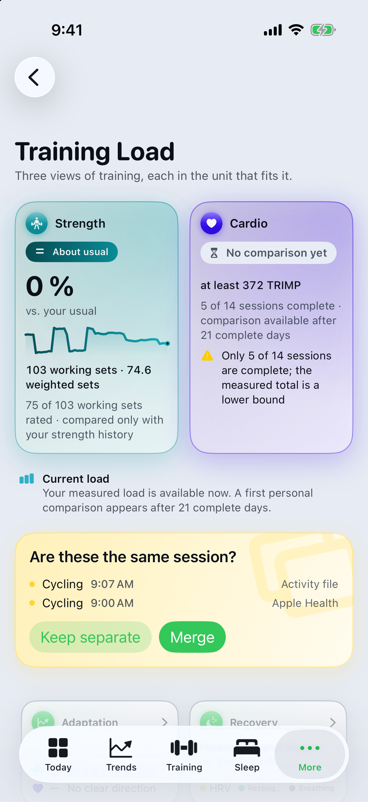
</td>
<td width="50%" valign="top">

### See fitness and fatigue without the guesswork

Chronic load (fitness), acute load (fatigue) and the balance between them, as a long-horizon
chart that keeps months and years of history. Cardio is priced by heart-rate reserve, strength by
working sets, and each lane stays in its own unit. Nothing here invents an "× usual" claim before
there is enough history to back it, and two records of the same session are offered for merging
instead of being counted twice.

</td>
</tr>
<tr>
<td width="50%" valign="top">
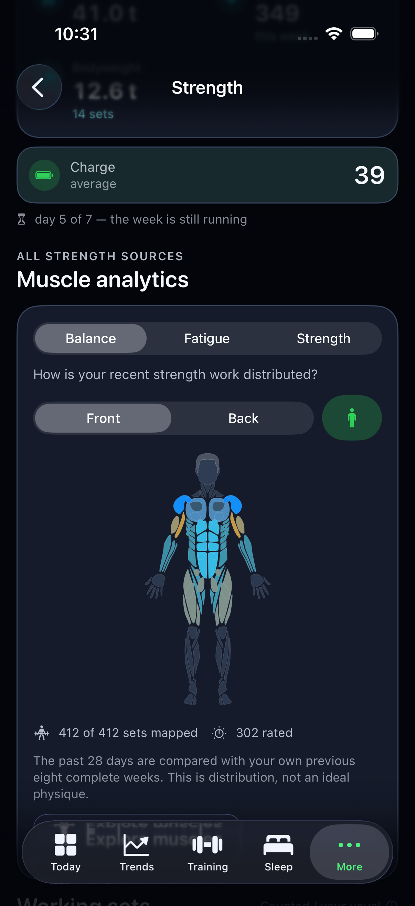
</td>
<td width="50%" valign="top">

### Log every set. Even in a basement gym.

Log sets directly in NOOP: routines, weekly schedules, supersets, unilateral work, RIR, rest
timers and plate loading, with a body-based muscle picker over one shared exercise catalogue.
Balance, Fatigue and Strength views share one detailed muscle map so working-set distribution,
remaining stimulus and e1RM trends all read off the same taxonomy. FitNotes, Strong and Hevy
imports join the same history without duplicating overlapping sets. An Apple Watch companion can
run the workout and show the current set and live heart rate; the set log stays on the phone.

</td>
</tr>
<tr>
<td width="50%" valign="top">
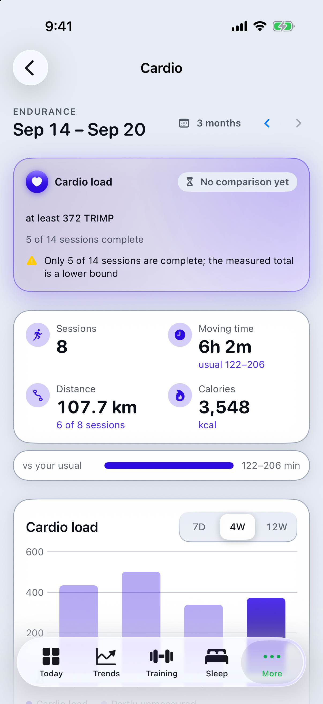
</td>
<td width="50%" valign="top">

### Lock the phone. The workout keeps going.

Live cardio recording continues while NOOP is backgrounded, the running session shows on the Lock
Screen and in the Dynamic Island, and starting a workout from Live, Workouts or a Quick Action
always resumes the same session. No more losing track of which screen "owns" the workout you're
mid-way through. GPX, TCX and FIT routes import alongside.

</td>
</tr>
<tr>
<td width="50%" valign="top">
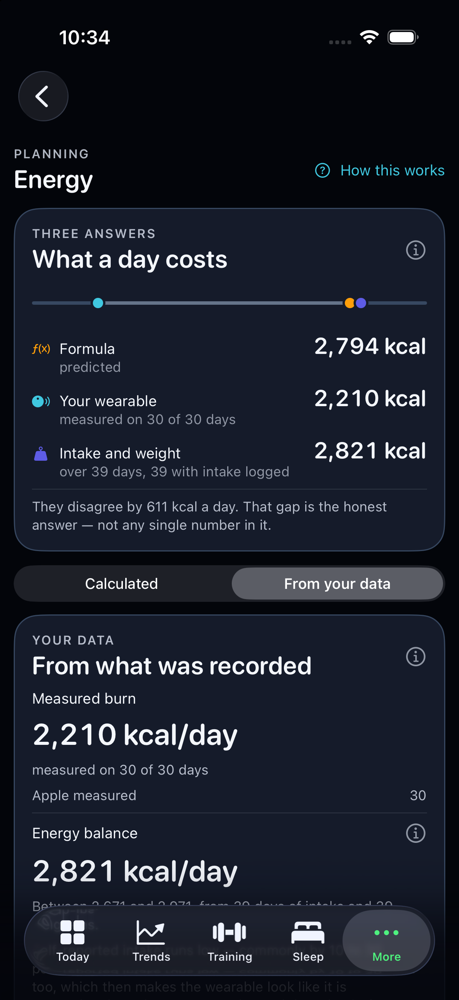
</td>
<td width="50%" valign="top">

### What your day really cost, and who says so

Weight history and trends get their own card. Daily energy expenditure blends NEAT, a personal
forecast curve and active-only calibration. Walks are priced by pace, other workouts by a VO₂max
that fits the body, and the page is always source-aware: it says whether a number came from WHOOP,
Apple Health, or an estimate, and shows the gap when independent estimates disagree. An opt-in
Apple Watch calibration step replaces silently trusting one device over another.

</td>
</tr>
<tr>
<td width="50%" valign="top">
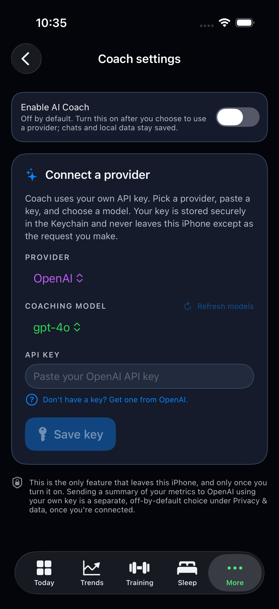
</td>
<td width="50%" valign="top">

### A coach that has read your whole history

Bring your own key (Anthropic, OpenAI, Gemini, OpenRouter or a custom endpoint) or run a model on
your own machine. The coach then answers from your real data through 30 tools you control one purpose
at a time: why your Charge is low, what a hard session does to tomorrow, whether coffee hurts your
sleep. It remembers what you tell it, using a semantic memory that runs inside the app, and it
proposes sessions and goals that you accept or ignore. It never saves one by itself. See
[the coach in detail](#the-coach-in-detail).

</td>
</tr>
<tr>
<td width="50%" valign="top">
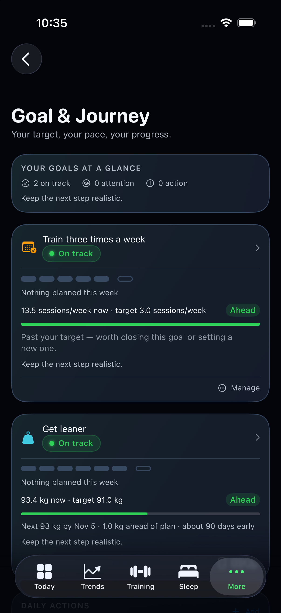
</td>
<td width="50%" valign="top">

### Goals that bend with real life

Four levels that can serve each other: **daily** goals (steps, sleep, a workout, a box to tick),
**weekly** and **monthly** goals (workouts, training minutes, distance, nights of enough sleep, zone 2
minutes, working sets and more), and **long-term** goals with a date and a route. Period goals are
read against a **pace**: the target spread over the planned days, with rest days left out and a mark
where the plan stands today. States are a word and a symbol, never colour alone. The Journey page
shows a measured percentage only when a real baseline and target exist. Milestones are facts, not a
streak counter that punishes a sick day, and a goal you pause or an illness protects its series.

</td>
</tr>
<tr>
<td width="50%" valign="top">
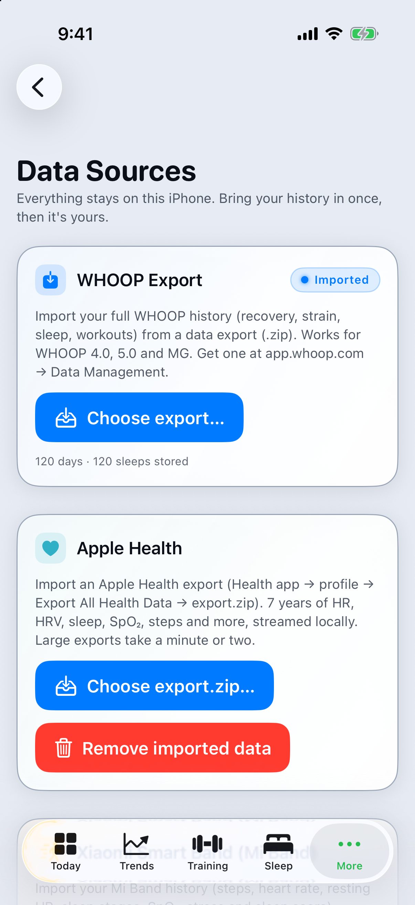
</td>
<td width="50%" valign="top">

### Bring everything you already have

Direct Bluetooth to a WHOOP 4.0 or 5.0/MG, a WHOOP CSV export, Apple Health, FitNotes, Strong and
Hevy strength imports, GPX/TCX/FIT routes, and an experimental Oura ring pairing: all parsed and
merged locally. A `.noopbak` backup covers your whole history for moving to a new device, and
goals and settings travel with it.

</td>
</tr>
<tr>
<td width="50%" valign="top">
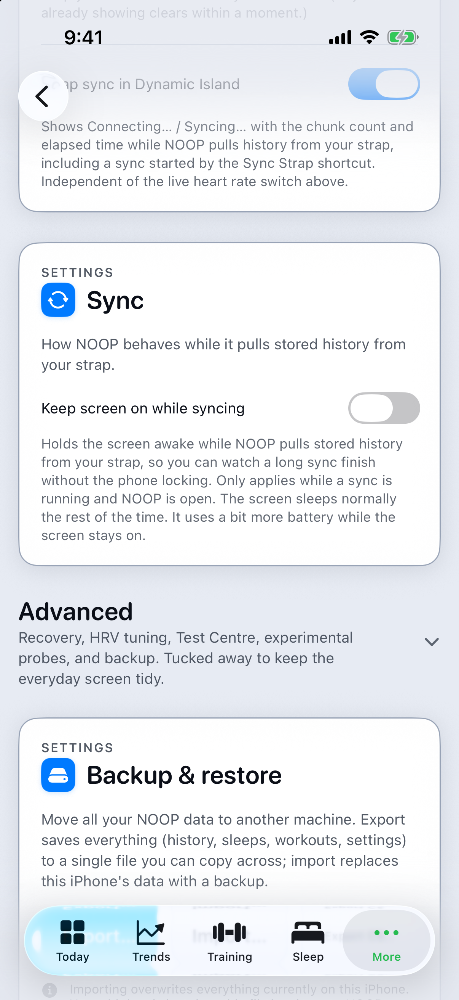
</td>
<td width="50%" valign="top">

### On your Home Screen, your wrist and your voice

Home Screen and Lock Screen widgets for the score rings, live heart rate, energy, stress, goals
and the coach's morning brief. A watchOS companion with complications. A Sync Strap Shortcut, a
keep-screen-on option while syncing, and a sync Live Activity for the Lock Screen and Dynamic
Island. Siri answers questions such as how your goals are going from the same on-device snapshot
the widgets read.

</td>
</tr>
</table>

### And the rest

| Area | What it does |
|---|---|
| **Breathe** | HRV haptic breathing trainer: the strap measures your HRV and buzzes the pace, with a catalogue of breathing protocols |
| **Intervals** | Haptic interval timer that works from the strap or the watch |
| **Stress** | Daytime stress on a 0 to 3 scale, with a Mind check-in beside it |
| **Illness early warning** | Opt-in. Compares the last two days with a 28-day baseline and says so when several signals move together. Informational, never a diagnosis |
| **Alarms and wind-down** | Strap wake-buzz alarms, a smart alarm window and an evening wind-down nudge |
| **Intelligence** | NOOP's own scores recomputed for any day with raw data, a forecast for tomorrow's Charge, and a plain explanation of the weighting |
| **Explore and Compare** | Metric explorer, period comparison, "what moves you" correlations and a lab book for your own measurements |
| **Weekly digest** | A short weekly summary with the week's training, sleep and a goals block |
| **Updates inbox** | One place for coach notes, goal check-ins and reminders; system notifications stay off by default |
| **Mac** | A sidebar app with a live connection pill, a menu-bar heart rate and a double-tap strap action |

## How the numbers are made

NOOP's scores are **honest approximations from published methods, not WHOOP's scores**. They are
computed from the strap's raw heart-rate, R-R, motion and temperature streams by pure, database-free
Swift code under `Packages/StrandAnalytics`, and every one is meant to be explained on the screen
that shows it.

- **Charge** weights overnight HRV (about 55%), resting heart rate (about 20%), rest quality
  (about 15%), respiration and skin temperature against your own rolling baselines.
- **Effort** is a cardiovascular load from time in heart-rate zones, scaled so a hard day reads hard
  for you.
- **Rest** stages sleep from heart rate and motion and is labelled when the night was only partly
  recorded.
- **Resting heart rate** is judged by physiology (the lowest five minutes of the main night), not by
  matching another app.
- **Training Load** keeps cardio and strength in their own units and compares a short window with a
  long one.
- **A method must track a varying input before it is trusted.** A single night that matches another
  app is not validation; new signal derivations ship as instrumentation or behind a default-off
  experimental toggle until they pass that bar.

Every score change that makes old numbers stale carries a versioned, resumable migration, so an
update re-scores history deliberately and never as a side effect. Details are in
[Analytics](docs/ANALYTICS.md) and the [FAQ](docs/FAQ.md).

## Supported hardware

| Device | Status |
|---|---|
| WHOOP 4.0 | Supported over Bluetooth: live heart rate, R-R, history sync, haptics |
| WHOOP 5.0 / MG | Supported over Bluetooth, including the extra raw streams this generation exposes |
| Generic heart-rate straps (Polar, Wahoo, Coospo, Garmin HRM and others) | Live heart rate through the standard Bluetooth profile |
| Apple Watch | Companion app for workouts, plus Apple Health as a data source |
| Oura ring | **Experimental**, behind its own switch; not a supported strap |

NOOP never sends destructive or write commands to the hardware, checks the CRC of every inbound
frame, and keeps protocol facts in the decoders instead of the app. See the
[WHOOP protocol notes](docs/PROTOCOL.md) and [Device support roadmap](docs/DEVICE_SUPPORT_ROADMAP.md).

## Where your data comes from

| Source | Brings |
|---|---|
| WHOOP strap, live | Heart rate, R-R, motion, temperature, battery, stored history |
| WHOOP CSV export | Years of past days, sleep, workouts |
| Apple Health | Steps, workouts, weight, VO₂max, nutrition, Watch heart rate |
| FitNotes, Strong, Hevy | Strength sets, merged without duplicates |
| GPX, TCX, FIT | Routes and cardio sessions |
| Manual logs | Caffeine, hydration, mood, journal, lab values, body weight |
| Oura (experimental) | History import |

Where two sources disagree, NOOP keeps both, says which one a number came from, and never picks a
winner silently.

## The coach in detail

The coach is the biggest thing this fork adds, so it gets its own chapter. It is **off until you turn
it on**, it is the only part of NOOP that can reach the internet, and everything it knows about you it
learned from data that stays on your phone.

### What it feels like to use

- **It has a name and a voice.** Pick Svea (warm) or Marv (grounded), or make your own: any name, a
  symbol, or your own photo. The photo never leaves the device. Separately choose how it coaches:
  *Guardian* (calm and protective), *Friend* (warm) or *Commander* (direct). It answers in your
  language and at the length you set.
- **It speaks first when it has something worth saying, and says so.** Each unprompted message is
  labelled as a brief, a check-in, a nudge or a weekly review, so you never wonder what you asked.
- **It waits for a night the data supports.** If the strap has only synced to 04:00 it does not
  announce a 04:00 wake time and plan your day on it. It holds the brief until the data lands, with a
  hard limit of about three hours so it never goes quiet for good, and a one-tap way to correct the
  sleep yourself.
- **It can show you.** Ask for your Charge or HRV trend and it draws the chart into the chat. The chart
  stays with the conversation.
- **It is reachable from anywhere you already are.** A banner on Today, a floating button you can pin
  to any corner, a card on every metric ("Ask coach" carries that metric as context), Siri and the
  Ask Coach shortcut. All of them are switches you control, and one master switch hides every one.

### What it can do: 30 tools

The coach does not guess from a pasted summary. It calls tools, the same way an assistant looks things
up, and each answer comes from the same numbers the app shows you.

| Group | Tools | Typical question it answers |
|---|---|---|
| **Today and recovery** | `get_biometric_summary`, `get_readiness`, `get_charge_drivers`, `get_stress_index` | "Why is my Charge low today?" It lists each driver with its signed points, your value and your baseline |
| **Sleep** | `get_sleep_detail` | "How did I sleep this week?" Stages, efficiency, disturbances and the rolling 14-night sleep debt |
| **Training** | `get_recent_workouts`, `get_zone_minutes`, `get_plan_adherence`, `get_training_preferences` | "Did I really train in Zone 2?" Minutes per zone, against your own zone edges in bpm |
| **What-if** | `get_session_outlook`, `simulate_day`, `estimate_session_effort` | "What does a hard session plus seven hours of sleep do to tomorrow?" Computed from your history, or declined when there is too little of it |
| **Energy** | `get_energy_balance` | "What did today cost?" Measured and modelled parts kept apart, never summed twice |
| **Long range** | `get_range_report`, `get_metric_history`, `get_data_catalog` | "How has my resting heart rate moved in three years?" Up to ten years, resolved on the phone first |
| **Patterns** | `get_personal_patterns` | "Is coffee hurting my sleep?" Only significant n-of-1 correlations, never causal claims |
| **Your logs** | `get_my_logs`, `get_sensitive_logs` | Caffeine, journal, hydration, mood and lab values. Sensitive journal fields need a separate grant and a related question |
| **Memory** | `remember_fact`, `update_fact`, `forget_fact`, `search_past_conversations` | "What did I ask you yesterday?" Works from a date alone |
| **Propose** | `propose_plan`, `propose_goal_setup` | Suggests a session or a goal. Nothing is saved until you accept |
| **Log for you** | `log_caffeine`, `log_journal`, `log_lab_marker`, `log_weight` | "I just had a double espresso." It writes to the same logs the app uses |
| **Draw** | `plot_metric` | A chart inside the conversation |

Tools run on OpenAI, Anthropic, Gemini and OpenRouter models. A custom local server gets no tools on
purpose, because tool support on local models fails silently. It still gets a pre-built context that
includes readiness, Charge drivers and your plan.

### It proposes. You decide.

The coach can suggest a session, a goal or a routine. It cannot schedule, accept or save any of them.
There is no tool that does.

- **Accepting asks for a time**, so the session is "10:00 CrossFit" and a reminder can fire, not
  "CrossFit sometime".
- **Effort is computed, not invented.** When the coach pitches a Zone 2 ride, the app calculates what
  that session is worth from your own zone edges and resting heart rate. A figure the model wrote that
  is off by more than five points is replaced, and the reply says what changed. Without this a coach
  once offered a 15-effort, 20-minute ride that was arithmetically worth about 30.
- **Swapping shows the cost first.** "CrossFit at 10:00 instead of Zone 2: about 18 points and two
  recovery days instead of 6 and one. Tomorrow's projection drops from about 62 to about 45." That is
  the same maths the swap screen shows before you tap.
- **Skipping needs a reason, not an apology.** One tap: no time, tired, pain, not feeling it, ill or
  travel. Pain and illness change how the coach talks. After a few declines it stops pitching that
  sport for a while but never shelves it forever.
- **Planned versus actual closes itself.** The app matches your accepted plans against the workouts
  it actually has, with fixed rules: the same day, a four-hour window for timed plans, matching sport
  families. One clear match completes the plan and keeps the evidence. Several candidates, or a vague
  "Workout" label, ask you. An old plan with no match stays open and is never silently marked skipped.
- **It learns from your answers.** Declined, accepted but not done, done and helpful, done with no
  effect, done and felt worse: five different outcomes. Repeated negative effects stop it proposing
  another hard version until it asks, and a weekend refusal changes the timing it suggests.

### Goals, with two safety gates

Goals follow the rules from [the goals feature](#goals-that-bend-with-real-life): a pace, honest
states and no streaks. The coach adds two checks before a goal is saved.

| Gate | Question | What it does |
|---|---|---|
| **Pace** | Is this aggressive? | Weight goals are measured as percent of body weight per week (over 0.75% warns, over 1.5% asks for a reason), running and consistency goals as percent of volume. It warns, asks, then lets you through |
| **Feasibility** | Is this realistic? | Uses your VO₂max estimate for performance goals. Weight goals are always "unknown", because there is no nutrition data to judge them by, and the coach says so |

Warning-sign symptoms such as chest pain, dizziness or unusual breathlessness get a hard stop and a
referral to a professional. That one is deliberately not overridable. The coach also never plans
nutrition.

### Memory that does not make things up

The coach keeps up to **120 facts** about you, and it treats them carefully.

| Rule | What it means |
|---|---|
| **Health facts wait for you** | An injury, a physiological fact or a goal is saved as pending. It does not frame every reply until you confirm it. It can still surface, flagged, so the coach asks instead of assuming |
| **Always-on versus on-topic** | Pinned and confirmed facts frame every reply. Everything else is ranked against the question you just asked, with a 30-day half-life, and only the top few go in |
| **Near-duplicates merge** | A rephrased fact updates the old one instead of using another slot. An ACL tear and a meniscus tear are held to a stricter match than a taste in music |
| **A restatement never downgrades** | It cannot unpin a pinned fact, unconfirm a confirmed one or clear an expiry |
| **Facts can expire** | "I'm travelling until Friday" retires itself, stays visible under Expired and is the first thing evicted |
| **Nothing is silent** | The reply that saved a fact shows a receipt with confirm, edit and forget. Each fact shows where it came from, how many observations back it and what it used to say |
| **Forgetting asks twice** | The second prompt names how many facts frame every reply, so you know what you would have to say again |

On iPhone a second layer finds meaning, not just words. The **Nomic Embed Text v2** model runs inside
the app and searches only text you approved: remembered facts, your own chat turns, titles and
summaries, journal notes and recommendation feedback. Raw heart-rate streams, numeric histories, lab
tables and the provider's replies are never embedded. The vectors live in their own deletable,
rebuildable file, outside your backup. A question waits at most 2.5 seconds for it and then falls back
to keyword search, so it can never slow a reply. Meaning and keywords are fused so names, dates and
exact terms still win when they should. The model unloads after two minutes idle.

**Conversations** keep your last 50 threads with 200 messages each. Pin the ones you return to and
they are exempt from the cap. Search finds "schl" inside "Schlaf". Export any thread as Markdown. A
daily brief opens its own thread, and one you never answered is archived after its day, never deleted.

### Privacy you can inspect

| | |
|---|---|
| **Off by default** | The coach feature, data access and every purpose |
| **Master switch plus nine purposes** | Core biometrics, long-term history, workouts, planning, stress, logging, sensitive logs, memory and patterns, each granted separately. Presets (Essentials, Personal, Deep insights) cover most people. Expert mode shows every switch |
| **Long history is separate** | A question about months or years needs its own grant, and the app first reduces it on the phone to one source's aggregate and trend |
| **A tool you did not grant does not exist** | It is left out of the list the model sees. The dispatcher checks again before reading anything |
| **Never sent** | Raw R-R, PPG or motion data. The tools read the same summaries the screens use, so there is no route for raw data to leave |
| **Receipts** | Under each answer from a model without tools, you can expand which data categories it drew on, by name and never by value |
| **Keys** | Stored in the Keychain, never in the repository, never in a log |
| **A fully local coach** | Point it at Ollama, LM Studio or llama.cpp and nothing leaves your network |
| **Lab reports** | A text PDF or a photo is read on the device, shown for review, and the file and its text are not kept |

### Providers

| Provider | Replies stream | Tools | Notes |
|---|---|---|---|
| Anthropic | Yes | Yes | Prompt caching, with a card in Settings that tells you whether it engaged |
| OpenAI | Yes | Yes | Automatic provider-side caching |
| OpenRouter | Yes | Per model | A searchable picker over its catalogue of 300+ models |
| Google Gemini | Yes | Yes | Tool schemas are reduced to what Gemini accepts, so one stray bound cannot reject all 30 |
| Custom (OpenAI-compatible) | Yes | No, on purpose | Ollama, LM Studio, llama.cpp or a hosted gateway. No key needed for a local server |

### Cost control

- **A cheaper model does the housekeeping.** Summaries and fact extraction use a small model per
  provider (for example Haiku on Anthropic). Automatic summaries are off by default. When on, they run
  when you leave a chat that has at least four new messages, and extract at most three facts, only from
  what *you* said.
- **Depth is a second model, not a hidden switch.** "Look at this more closely" on a reply you have
  already read re-asks with a stronger model you chose. It applies to one question and then clears. The
  app never escalates by itself, because a coach that is sometimes cheap and sometimes expensive for no
  visible reason reads as broken.
- **Usage is visible.** Rounds and token counts, including cache hits, are logged on the device so "is
  this saving money" has a number for an answer.
- **Reasoning models get headroom.** A model that spends its output budget thinking now tells you, in
  place of an unexplained empty reply.

### When something goes wrong

| Failure | What you see |
|---|---|
| Key rejected | A button that takes you straight to the key, since retrying fails the same way |
| Rate limited | A countdown from the provider's own retry time |
| Offline | A message that also says the rest of NOOP keeps working |
| Provider error | Retry, because it is usually transient |
| Setup problem | No retry button, because it would fail identically |

"Test connection" runs a real message through the normal path, so a pasted key is checked before your
first real question.

### It speaks first, carefully

- **A morning brief** per day, in its own thread, and a daily check-in notification that is
  deliberately generic, because its text is fixed when scheduled and a stale number is worse than none.
- **Hints in the bell.** Milestones, setbacks, body concerns, small wins and goal deadlines arrive as
  inbox items with a relevance window (seven days for a milestone, two for a body concern). Only a
  plan proposal ever asks for a decision, and it appears with Accept, Change and Decline.
- **Proactive level.** Off, important only, or everything. The inbox follows the same setting, so
  turning it down empties it too.
- **Goal and weekly reviews**, plan reminders, and a quiet receipt when a workout closes a plan on
  its own.

The technical reference, with every tool's parameters, is in the [Coach guide](docs/fork/COACH.md).

## Privacy, precisely

NOOP Forge is offline-first. Your strap data, database, scores, history, goals, coach memory and
plans stay on your device. The optional AI Coach contacts only the provider you configure, only
when you ask it to; an experimental Oura history import and the manual/at-most-daily public-release
check are the only other network paths, and neither uploads raw sensor streams or gives NOOP a
server or account.

- No NOOP server, no account, no analytics, no crash reporting that phones home.
- No WHOOP firmware, decompiled app code, logos or DRM circumvention: this is clean-room
  interoperability with hardware you own.
- Backups are a single file you control.

More detail: [Privacy and security](docs/PRIVACY_SECURITY.md) and [Scope](docs/SCOPE.md).

## Install

### iPhone and iPad

The iOS build is an **unsigned IPA on purpose**. Add the source below in AltStore or SideStore,
and the sideloader signs the app locally with the Apple ID you choose. NOOP Forge never receives
your Apple ID or a signing certificate.

**Source URL:**

```
https://raw.githubusercontent.com/DX23876/noop/main/altstore-source.json
```

- **AltStore:** Browse → **+** → paste the source URL → add NOOP Forge.
- **SideStore:** Sources → **+ Add Source** → paste the same URL → install NOOP Forge.
- Prefer a direct file? Download `NOOP-ios-unsigned-v11.8.5-dx.ipa` from the
  [11.8.5 release](https://github.com/DX23876/noop/releases/tag/v11.8.5-dx). It includes the
  Home/Lock-Screen **widgets**, which AltStore/SideStore sign along with the app.
- Need the **Apple Watch** app? The same release also carries
  `NOOP-ios-full-unsigned-v11.8.5-dx.ipa`, which adds the Watch app and complication. It wants a
  signer or paid Developer team that can provision all of it together. Sideloaders install an
  embedded watchOS bundle unreliably, and a failure there costs you the whole install, which is why
  the AltStore source stays on the watch-less IPA.

A free Apple ID signs an app for seven days, so AltStore or SideStore has to refresh it weekly. See
[the iOS install guide](docs/IOS.md) for the free-Apple-ID limits, widget notes, troubleshooting and
build-from-source instructions.

### Mac

Download `NOOP-macos-v11.8.5-dx.zip` from the
[11.8.5 release](https://github.com/DX23876/noop/releases/tag/v11.8.5-dx), unzip it, then
**right-click → Open** the first time (it is ad-hoc signed, not notarised, so a double-click is
blocked).

The bundle is universal: Apple Silicon and Intel. Ad-hoc signing is what lets macOS bind the
Bluetooth permission to the app; after an update macOS may ask you to re-approve Bluetooth,
because the code identity changes with every build.

### Build from source

You need a Mac with Xcode 26+ and [XcodeGen](https://github.com/yonaskolb/XcodeGen).

```bash
git clone https://github.com/DX23876/noop.git
cd noop
xcodegen generate
open Strand.xcodeproj
```

Choose **NOOPiOS** and a physical iPhone (or simulator) to build iOS, or **Strand** for macOS.
`Strand.xcodeproj` is generated from `project.yml` and is never committed. The coach's on-device
memory needs the Nomic model files, which `Tools/bootstrap-nomic.sh` fetches.

### Updating and moving

Bundle identifiers, the App Group and the store path stay the same between releases, so an
installed app keeps its data, Health permissions and update path. To move to a new phone, export a
`.noopbak` backup in Backup & Sync and import it on the other device.

### Platform status

| Platform | Status | Distribution |
|---|---|---|
| iOS / iPadOS | 11.8.5 | AltStore, SideStore, or build from source |
| macOS | 11.8.5 | Packaged `.zip` in the release, or build with Xcode |
| Apple Watch | 11.8.5 | Full IPA only |
| Android | Not shipped by this fork | Use [ryanbr's upstream Android project](https://github.com/ryanbr/noop) |

## Under the hood

Core logic lives in cross-platform Swift packages, with each Apple platform as a thin app layer
over them. The more wire-level or math-level a piece of code is, the deeper it sits, and the more it
is covered by tests that run with no app, no strap and no Bluetooth.

| Layer | Where | What lives here |
|---|---|---|
| Protocol | `Packages/WhoopProtocol`, `OuraProtocol`, `PolarProtocol` | BLE frame parsing, CRC, command and event decoding. No CoreBluetooth, builds standalone, ships a `whoop-decode` command line tool |
| Storage | `Packages/WhoopStore` | GRDB/SQLite persistence, versioned migrations, streams and caches |
| Analytics | `Packages/StrandAnalytics` | HRV, recovery, strain, sleep, training load, goal pace and correlation math: database-free, pure functions |
| Training | `Packages/StrandTraining`, `MuscleMap` | Routines, exercise catalogue, set math, muscle taxonomy and maps |
| Memory | `Packages/SemanticMemory` | On-device embeddings and retrieval for the coach |
| Import | `Packages/StrandImport` | WHOOP CSV, Apple Health, FitNotes/Strong/Hevy |
| Design system | `Packages/StrandDesign` | SwiftUI palette, components and charts shared by every screen |
| Coach | `Strand/AI` | Chat shell, providers, tools, goals and consent. Shared lineage with `ryanbr/noop`, extended with memory, tool-calling and goal tracking (fork-only) |
| Apps | `Strand` (macOS and shared), `StrandiOS`, `StrandiOSWidgets`, `NOOPWatch*` | Screens, Bluetooth, collection, widgets, Live Activities and the watch |

`ryanbr/noop`'s protocol reverse-engineering, analytics groundwork and design system are the base
this fork builds on. Where the two diverge (Apple-only distribution, the extended coach, native
training, goals) the work is kept in its own layer so upstream fixes can keep merging in cleanly.
The [architecture overview](docs/ARCHITECTURE.md), [data model](docs/DATA_MODEL.md) and
[package library](docs/LIBRARY.md) go further.

## Quality and verification

- **Package tests** run with a plain `swift test` and need no Xcode, strap or Bluetooth. They cover
  the protocol decoders, storage and migrations, analytics, imports and the training math.
- **Pinned formulas.** Analytics changes ship with a test and, where a formula is ported from a
  published method, with the reference values it must reproduce.
- **App targets** are built with `xcodebuild` before anything that touches them is pushed; the
  Mac `StrandTests` suite runs on every release build.
- **Bluetooth behaviour** can only be proven on a real strap, so connection changes are tested on
  hardware and say so.
- **Translations** are checked by an audit that fails when a new string is missing a language.
- **Benchmarks** for sleep staging, energy and memory retrieval live under `Tools/` and are used to
  judge a change before it ships.

## Documentation

- [Complete documentation map](docs/README.md)
- [Feature reference](docs/FEATURES.md)
- [iOS install and build guide](docs/IOS.md)
- [Build and signing guide](docs/BUILD.md)
- [Coach guide](docs/fork/COACH.md)
- [Analytics](docs/ANALYTICS.md) and [FAQ](docs/FAQ.md)
- [Training and muscle analytics](docs/fork/MUSCLE_ANALYTICS.md)
- [Privacy and security](docs/PRIVACY_SECURITY.md)
- [Fork maintenance](docs/FORK_GUIDE.md)
- [Contributing](docs/CONTRIBUTING.md)

## About the project

NOOP Forge is an independent, personal fork of [ryanbr/noop](https://github.com/ryanbr/noop) and not
the official NOOP app; it was called NOOP AI until October 2026. The upstream project
deserves credit for the protocol, analytics and design-system foundations, and continues to
develop its own coach in parallel; this fork develops the extended coach (memory, tools, goals),
native training and Apple-first sideload distribution independently. It is an unofficial,
non-commercial interoperability project and is not affiliated with WHOOP.

The BLE protocol work builds on community research, with thanks to
[`johnmiddleton12/my-whoop`](https://github.com/johnmiddleton12/my-whoop) (WHOOP 4.0),
[`b-nnett/goose`](https://github.com/b-nnett/goose) (WHOOP 5.0/MG) and
[`groue/GRDB.swift`](https://github.com/groue/GRDB.swift) (SQLite).

## Disclaimer

NOOP Forge is not a medical device. Its health and training values are on-device estimates, not
clinical advice or diagnosis. Use it as a personal tool and consult a qualified professional for
medical decisions.

## License

Source-available under the [PolyForm Noncommercial License 1.0.0](LICENSE). See
[NOTICE](NOTICE) and [ATTRIBUTION.md](ATTRIBUTION.md) for bundled dependency and upstream credits.
